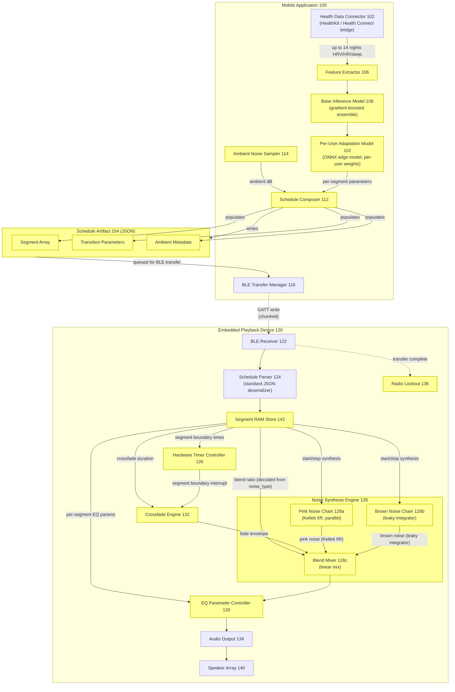
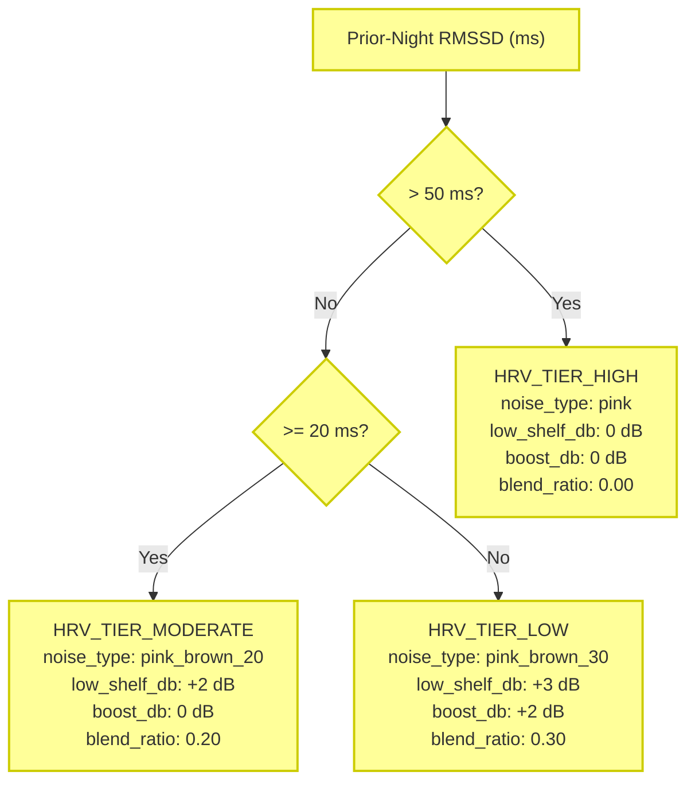
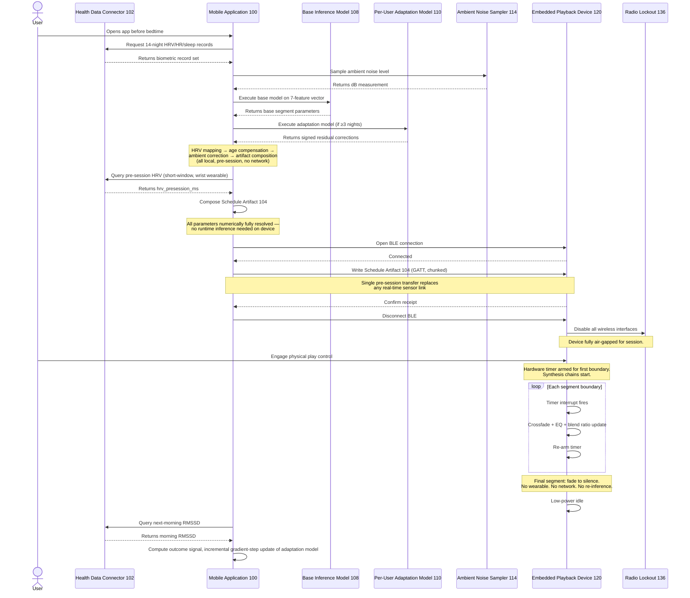
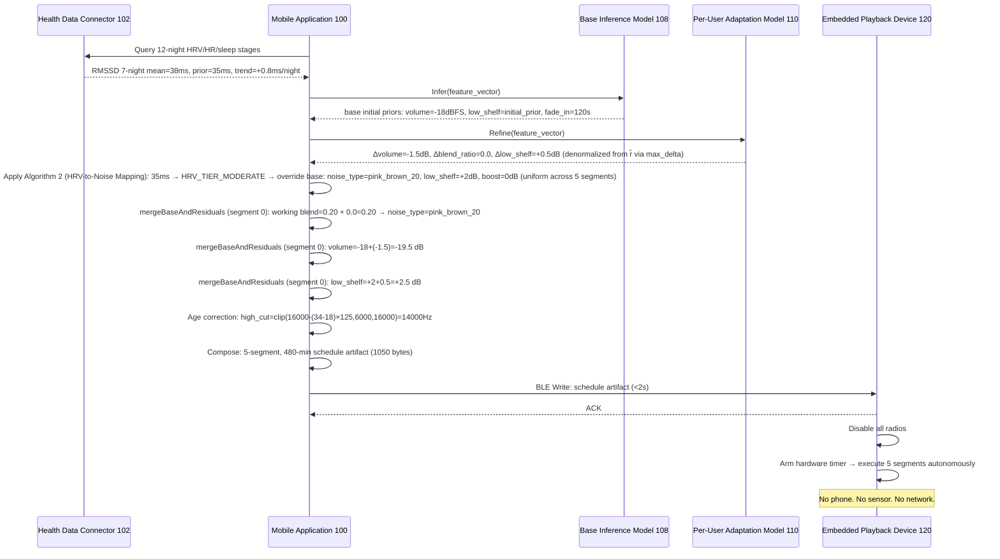
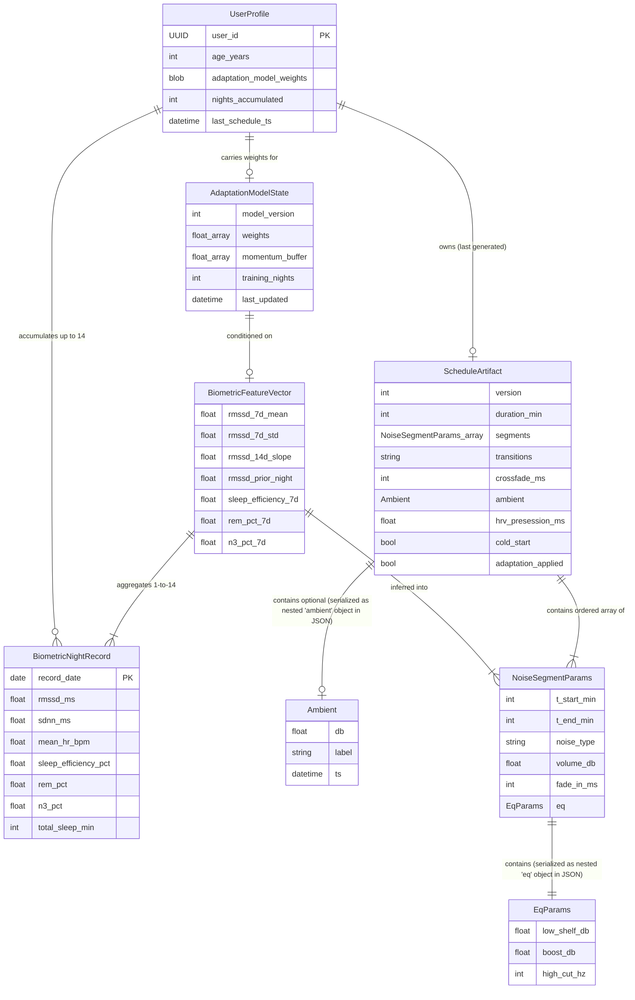

# Patent Disclosure: Historical HRV-Based Pre-Session Sleep Noise Scheduling

**Assignee:** Prostec Labs Pte. Ltd.  
**Inventor:** Zack Lau (zack@prostec.ai)  
**Conception Date:** 2026-02  
**Disclosure Date:** 2026-05-18  
**Prior Public Disclosure:** False  
**Prior Sales:** False  

> **Document-handling note (not part of the technical disclosure):** This document contains attorney/preparer-facing prosecution-strategy material that must be reviewed for removal from the specification text actually filed as the provisional — including the "examiner may argue/combine" framing of the §11 §103 Combination Analysis, the §12 "Filing note" and "AAPA notation" paragraphs, the §13 "35 USC 101 Analysis," "§101 Risk Summary," and "Claim-to-Code Mapping," and the claim-narrowing guidance in §12 "Scope of Inventor's Awareness — Filing Note." Filing such work product verbatim creates intrinsic-record statements about claim weakness. Final inclusion decisions rest with prosecuting counsel; the technical disclosure proper is §§1–10, the §11 alternatives descriptions, the §12 reference identifications, and the draft claims.

---

## Novelty Statement

A system and method for generating personalized sleep-enhancing acoustic schedules from historical biometric data, and executing those schedules autonomously on a dedicated hardware device during sleep — without any wearable sensors, real-time processing, or network connectivity during the sleep session.

Existing adaptive sleep acoustic systems known to the inventors (Endel, Neurolight, Dreem, and the sensing embodiments of ResMed WO2015006364A2) require continuous biometric monitoring or network connectivity during the sleep session itself. Their personalization logic depends on real-time sensor input, meaning the playback device must remain actively connected throughout the night. These systems, as documented in the references known to the inventors, do not function as standalone, offline devices, and they require the user to wear biometric hardware during sleep, which many users, particularly those with ADHD or medication sensitivities, find disruptive or uncomfortable.

The inventive insight is that HRV and heart rate trends accumulated over up to fourteen prior nights from a consumer wrist-worn wearable — with full two-stage personalization engaging once at least three nights are available, and a population-prior cold-start mode operating below that threshold — are usable to pre-compute a complete, personalized sleep noise schedule before the session begins. An on-device edge AI model processes these historical trends and produces a structured artifact: a time-segmented noise schedule encoding noise type (pink/brown blend), per-segment volume, age-compensated EQ parameters, and a crossfade duration. This artifact is transferred once via Bluetooth to a dedicated BLE-only playback device before sleep. The device then executes the full schedule autonomously using only its internal timer for the entire sleep session.

---

## §1 — Executive Summary

The invention is a sleep acoustic system that uses a person's own historical biometric data, collected during normal daytime wearable use, to pre-compute a personalized noise schedule that plays automatically on a standalone bedside device throughout the night.

The problem it addresses is specific: users who cannot tolerate worn sensors during sleep cannot use existing adaptive sleep audio systems, because those systems require the user to wear biometric sensors during the night and maintain an active wireless connection to function. Their personalization logic runs against real-time sensor input, which makes them unsuitable for use as simple, self-contained devices.

The system applies wherever a person has consistent overnight wearable data from a mainstream consumer platform and wants a pharmacologically neutral, sensor-free sleep aid. It is suited for home use, travel, and any context where network availability during sleep cannot be guaranteed.

---

## §2 — Novelty

### 1. The Inventive Concept

Multi-night HRV trends alone are usable to fully specify a personalized sleep acoustic session in advance, eliminating in-session sensing entirely.

### 2. Differentiation from Known Approaches

**ResMed WO2015006364A2:** Unlike WO2015006364A2 — whose sensing embodiments close their audio control loop on a real-time non-contact motion sensor during the sleep session, and whose broadest family claim (US20160151603A1 claim 1) is a sensor-free apparatus that period-adjusts a fixed paced-breathing cue sound file in real time on the playback apparatus itself — this invention generates the complete multi-segment schedule from historical biometric data alone and transfers it before sleep: the playback device has no sensor inputs and performs no in-session parameter adaptation whatsoever.

**Philips US11612713B2:** Unlike US11612713B2, which adjusts audio parameters in response to physiological signals measured in real time during sleep, this invention performs all inference before sleep onset and produces a static executable artifact requiring no in-session sensor input or network access.

**Dreem / Beacon Biosignals:** Unlike Dreem, which requires an EEG headband worn during sleep as the primary input source, this invention places no hardware on the user's body during sleep — the biometric data it consumes was collected passively by a wrist-worn device during waking hours.

**Endel:** Unlike Endel, which requires a persistent connection to a smartphone or cloud service during playback, this invention's playback device receives all necessary parameters in a single pre-session BLE transfer and thereafter operates with all radios off. This distinction is structural rather than behavioral: independent of any offline playback mode Endel may offer, Endel is not known to the inventors to produce a numerically resolved time-segmented synthesis-parameter artifact, nor to execute one on a dedicated sensor-free embedded device via internal hardware timer with all radios disabled.

**Neurolight:** Unlike Neurolight, which — to the inventors' understanding — requires persistent network connectivity during the sleep session, this invention treats connectivity as a pre-session transfer medium only, with no network dependency after the initial schedule receipt. As with Endel, the durable distinction is structural: the inventors are not aware of any numerically resolved time-segmented schedule artifact or sensor-free hardware-timer-driven embedded executor in Neurolight's architecture.

**Sleep Cycle / SoundSleepNet:** Unlike SoundSleepNet and Sleep Cycle, which produce outputs consumed by a general-purpose smartphone running standard media playback, this invention produces a structured, hardware-targeted schedule artifact transferred to and executed autonomously by a dedicated embedded device via internal hardware timer.

### 3. Non-Obvious Elements

**Historical data sufficiency as an architectural premise.** In the inventors' assessment, a skilled engineer approaching adaptive sleep audio would default to closed-loop design. The non-obvious insight is that, for the specific task of pre-parameterizing a noise schedule, night-to-night HRV trends (RMSSD/SDNN aggregated over 7- and 14-night trailing windows) are sufficiently stable — multi-night aggregation attenuates single-measurement error in consumer PPG-derived RMSSD, and the tier mapping of §6 requires only coarse three-way stratification (<20 ms / 20–50 ms / >50 ms) rather than clinical-grade per-measurement accuracy (§2.6) — that a static pre-computed schedule is usable as a personalized intervention while eliminating the entire in-session sensing stack.

**Deliberate capability removal as a design constraint.** The playback device intentionally lacks WiFi, a microphone, any analog input, and any sensor interface. In the inventors' assessment of conventional product design practice, removing capabilities is typically a cost decision. Here, the removed capabilities are recited as negative limitations in the claims: a device with no in-session sensing capability cannot fall into the prior-art pattern of closed-loop adaptation.

**Age-compensated frequency ceiling as a first-class schedule parameter.** Encoding `high_cut_hz = clip(16000 − (age−18)×125, 6000, 16000)` directly into the per-segment EQ object, rather than applying it as a post-processing stage, means the schedule artifact is fully self-describing and device-agnostic. The playback device requires no knowledge of the user's age or any audiological model — it merely executes EQ coefficients. This separation of inference (on the phone) from execution (on the device) is a non-obvious architectural split; the references known to the inventors implement a single integrated pipeline rather than this split.

**Two-model inference architecture for cold-start and personalization.** The combination of a shared population-level base model with a per-user adaptation model is non-obvious in the sleep audio context. The base model provides population-prior outputs for new users with limited history; the adaptation model applies signed residual corrections as personal HRV history accumulates. The references known to the inventors employ single-model personalization rather than a split of this kind. The two-model split is motivated by the constraint that inference must complete on a mobile device without network access and within a latency budget compatible with a pre-sleep routine.

### 4. Scope of Novelty

**Broadest defensible claim (general principle):**
A method of generating a personalized sleep acoustic session comprising: collecting historical physiological trend data from a user over a plurality of prior nights; inferring, using a machine-learning model executing on a mobile device, acoustic session parameters from said historical data without any in-session physiological sensing; encoding said parameters as a time-segmented schedule artifact; transferring said artifact to a dedicated playback device prior to sleep onset; and executing said artifact autonomously on said playback device during the sleep session without network connectivity, sensor input, or external compute dependency.

**Intermediate claim levels:**
1. The method of the broadest claim, wherein the historical physiological data comprises heart rate variability metrics (RMSSD, SDNN) and sleep stage classifications derived from a consumer wrist-worn wearable device used during waking and sleep hours preceding the session.
2. The method of claim 1, wherein the schedule artifact comprises time-delimited segments each specifying at least: noise type, volume in dBFS, fade envelope timing, and parametric EQ coefficients; and wherein the playback device executes segment transitions using only an internal hardware timer.
3. The method of claim 2, wherein the machine-learning model comprises a population-level base model shared across users and a per-user adaptation model, and wherein inference produces noise synthesis parameters that vary as a function of RMSSD range.
4. The method of claim 3, wherein the schedule artifact further encodes an age-compensated high-frequency cutoff parameter computed as a linear function of user age, and wherein noise synthesis on the playback device applies said cutoff without access to the user's age or any audiological model.

**Narrowest specific implementation:**
A BLE-only dedicated embedded playback device that receives, prior to sleep onset, a JSON schedule artifact produced by a two-stage inference pipeline (population-level base model + per-user adaptation model) running on a mobile OS from wearable health platform data, and synthesizes pink and brown noise using a multi-pole IIR approximation (Kellett algorithm) for pink and a leaky integrator for brown, executing segment transitions — including crossfades and EQ parameter changes — driven solely by the device's internal hardware timer, with all wireless radios disabled during playback.

### 5. Technical Advantage

**Elimination of in-session hardware burden.** The user wears no sensor and no head-mounted device during sleep; device cost and failure modes are reduced relative to EEG- or accelerometer-equipped sleep systems by the absence of those components.

**Offline operation with zero in-session power draw from connectivity.** With WiFi and BLE disabled during playback, the playback device's power budget is consumed entirely by the DAC, amplifier, and timer — no radio duty cycling, no packet retransmission, no cloud API latency. Consequences include reduced electromagnetic emissions during the session, extended battery life relative to a continuously-radio-active comparable device, and elimination of the failure mode where network disruption degrades audio during sleep.

**Deterministic execution.** Because the schedule is pre-computed and encoded with explicit segment boundaries and transition timings, the playback is bit-reproducible across sessions with identical schedules.

**Privacy by architecture.** No biometric data leaves the mobile device during or after schedule generation; the playback device receives only synthesized acoustic parameters. The schedule artifact contains no raw physiological data. On-device inference means no biometric record traverses an external network.

**Inference efficiency.** The two-stage model runs to completion on a mid-range mobile SoC within the latency budget of a pre-sleep routine — combined model inference in under approximately 1.5 seconds, full schedule-generation pipeline within a 5-second target, with the ten-second bound recited in Claims 3 and 16 providing margin for lower-end devices — without requiring a network round-trip or GPU acceleration. See §10 Latency Enablement for model-size derivation.

### 6. Secondary Considerations

#### Long-Felt, Unmet Need

The problem of providing personalized acoustic sleep enhancement without in-session wearable sensors has remained unsolved across at least two decades of published research and commercial development.

Carter et al. (*Noise & Health*, 2004, PMID 12071548) documented that nocturnal traffic noise induces sympathetic cardiovascular activation with no habituation — establishing that uncontrolled acoustic sleep environments cause physiological harm. Capezuti et al. (*J. Clin. Sleep Med.*, doi:10.5664/jcsm.9860, 2022) — a systematic review of 34 intervention studies, 1,103 subjects — found pink noise produced positive outcomes in 81.9% of trials, yet explicitly called for future research addressing individual variability as necessary to resolve inconsistent results. This is a peer-reviewed acknowledgment that no existing protocol adequately handles between-person variability in acoustic sleep intervention response.

The clinical severity of that gap was established by Nigg et al. (*JAACAP*, 2024, PMID 38428577): the same pink/white noise intervention produced a significant positive effect for individuals with elevated inattention (Hedges' g = +0.249) but a significant negative effect for neurotypical controls (g = −0.212). Personalization therefore appears, based on the cited literature, to be necessary to avoid adverse outcomes in a subpopulation. The inventors' hypothesis is that HRV is a biomarker suited to indexing which response a user is more likely to have, because depressed HRV indexes the autonomic dysregulation associated with the inattention-elevated subpopulation (Thayer 2012; Imeraj 2012); the cited references establish that association, not HRV tier as a clinically validated predictor of acoustic response polarity.

#### Scientific Basis for HRV as Personalization Signal

The use of historical HRV as the sole personalization input is grounded in a body of published research establishing HRV as a stable, predictive, and causally linked biomarker of sleep autonomic state.

At a foundational level, Kobayashi and Musha (1982, *IEEE Trans. Biomed. Eng.* 29(6):456–457) established that healthy heartbeat interval series exhibits 1/f (pink) spectral structure — the same 1/f spectral character as the pink-noise component of the synthesized acoustic output. Dysregulation shifts this exponent toward white noise, making the 1/f spectral index a biomarker of autonomic health. Grimaldi et al. (*SLEEP*, 2020, PMC7729207) demonstrated the inverse channel: acoustic stimulation delivered during sleep enhanced slow-wave activity by approximately 40% (ON versus OFF intervals) and increased high-frequency HRV (parasympathetic index) by 17% and 24% in the second and third sleep cycles respectively versus sham, with the slow-wave enhancement correlating with an attenuated evening-to-morning cortisol rise — an experimentally demonstrated acoustic-to-autonomic causal channel that justifies using HRV as the schedule input. Wang et al. (2025, *PMC12459731*) confirmed in a clinical ward setting that reducing sleep-environment noise (≈56 → ≈45 dB LAeq) yielded post-intervention SDNN approximately 7.4 ms higher than the standard-ward control, a reduced LF/HF ratio, substantially lower morning cortisol, and improved PSQI sleep quality scores.

Bylsma et al. (2024, *Psychophysiology*, PMC11579239) demonstrated in 303 adults across a 7-day ecological momentary assessment that a single laboratory resting HRV measurement significantly predicted behavioral emotion regulation outcomes across the following week, establishing that resting HRV is a stable, ecologically valid predictor of subsequent physiological and behavioral states.

#### Failure of Others and Market Demand

The Dreem headband and Bose Sleepbuds — the prior personalized approaches requiring worn in-sleep hardware — were each discontinued, with the EEG-headband and in-ear form factors reported in coverage known to the inventors as overnight-use barriers. Bose recalled the first-generation Sleepbuds in 2019 due to battery defects and discontinued the Sleepbuds product line in 2023, stating publicly that the product did not reach the level of adoption the company had hoped for. To the inventors' understanding, this commercial history is consistent with the worn form factor being a limiting constraint for in-sleep hardware. Non-personalized bedside hardware (Hatch Restore class, $130–250) commands documented commercial adoption, indicating market viability for dedicated sleep devices and consistent with the wearable burden being the principal adoption barrier for personalized approaches. Nigg 2024's polarity reversal indicates that personalization may be necessary for the inattention-elevated subpopulation. The nexus to the claims is direct: Claim 1 eliminates the worn-hardware burden; Claim 7 operationalizes HRV-tier-based personalization; and Claims 2 and 9 recite the offline autonomous-operation limitation.

#### Unexpected Results

**Unexpected Architectural Result.** The two-stage split (compact population base + tiny per-user adaptation model) achieves first-night usable output — population-prior schedule generated in under approximately 1.5 seconds on commodity mobile hardware — at a combined weight footprint under approximately 1 MB, without any per-user training data. These figures are architecture-derived estimates supported by the component-level derivation in §10 Latency Enablement. A skilled engineer presented with the personalization requirement would have predicted that a single end-to-end per-user model is necessary, requiring approximately 10–50 MB and 3–15 seconds inference, with no usable output before sufficient personal history accumulates. The unexpected result is that the architectural decomposition — population prior for parameters, per-user model for signed corrections only — eliminates the cold-start problem structurally while satisfying the mobile latency constraint, producing a concrete technical performance improvement that neither model class alone achieves.

Nigg et al. (2024) documented a polarity reversal at statistically significant magnitude: acoustic noise interventions produce a significant positive sleep outcome in individuals with ADHD or elevated inattention (Hedges' g = +0.249, 95% CI [0.135, 0.363]) but a significant negative outcome in neurotypical controls (g = −0.212). The asserted nexus to multi-night RMSSD is as follows: HRV depression indexes ADHD-associated autonomic dysregulation (Thayer et al., *Biol. Psychol.* 2012; Imeraj et al., *Eur. Child Adolesc. Psychiatry* 2012), and the 7-night trailing aggregate separates HRV_TIER_LOW (<20 ms) from HRV_TIER_HIGH (>50 ms) populations. The use of HRV tier as a predictor of acoustic-intervention response polarity is the inventors' hypothesis built on these published associations — no prior reference known to the inventors identified or validated HRV tier as a determinant of acoustic intervention response polarity.

**Secondary Considerations — Mobile Subsystem (Claim 16 scope).** Capezuti 2022 found no prior protocol achieved individualized acoustic parameter selection without real-time sensor input. Consumer PPG-based wrist-wearable RMSSD is an estimate of, not a substitute for, clinical ECG-derived RMSSD, and published agreement varies by device and measurement condition. The disclosed pipeline is designed to be robust to that measurement error: the 7-night trailing aggregation attenuates single-measurement noise, and the HRV-tier mapping requires only coarse three-way stratification (<20 ms / 20–50 ms / >50 ms) rather than per-measurement clinical accuracy — fidelity sufficient to drive the tier mapping despite the measurement modality. No prior iOS or Android application known to the inventors generates a numerically fully resolved, time-segmented acoustic schedule artifact from multi-night historical HRV via on-device two-stage inference and transfers that artifact to a dedicated embedded playback device before sleep.

#### Distinction from HRV-Indexed Preset Selection

A skilled engineer presented with the Nigg 2024 polarity-reversal finding could conclude that HRV-indexed preset selection — for example, mapping each of three RMSSD tiers to one of three pre-recorded audio files — is a plausible response to the personalization requirement. That approach is structurally distinct from the disclosed two-stage inference architecture. Preset selection produces, for any given HRV tier, a single static output identical across all users in that tier; the disclosed per-user adaptation model produces signed residual corrections (Δvolume, Δblend_ratio, Δlow_shelf) applied element-wise to the base model output, each correction fit to the individual user via incremental on-device gradient updates against a per-user outcome signal (§6 Per-User Adaptation Model 110; §10 Outcome Signal). As a user accumulates outcome history, the user-specific schedule diverges from the population base — Case Study 1 in §7 shows the adaptation model overriding the HRV-tier-mandated 20% brown blend with pure pink for later sleep cycles based on the user's individual response history, an outcome that no preset-selection scheme described in the prior art known to the inventors produces. The disclosed personalization mechanism is therefore a longitudinal closed-loop optimization on each individual user's outcome signal.

---

## §3 — Introduction


### Heart Rate Variability and Autonomic Nervous System Assessment

Heart rate variability (HRV) is the beat-to-beat variation in the time interval between successive cardiac contractions. Rather than measuring average heart rate, HRV quantifies the irregularity of that rhythm — a property governed primarily by the autonomic nervous system (ANS). Two metrics are in widespread clinical use: RMSSD (root mean square of successive differences), which captures short-term parasympathetic activity by computing the square root of the mean of squared differences between adjacent R-R intervals; and SDNN (standard deviation of all normal-to-normal R-R intervals), which reflects total ANS variability over a measurement window. Resting RMSSD in healthy adults falls in the range of 20–80 ms, with higher values associated with greater parasympathetic tone. Consumer-grade optical heart rate sensors in wrist-worn wearables can estimate these metrics from photoplethysmography (PPG) signals, making continuous passive HRV collection feasible outside clinical settings.

### Sleep Architecture

Human sleep follows a cyclical structure of approximately 90-minute periods across the night. Each cycle comprises non-rapid eye movement (NREM) stages — N1 (light sleep onset), N2 (sleep spindles, K-complexes), and N3 (slow-wave sleep, characterized by high-amplitude delta oscillations) — followed by REM sleep. N3, or slow-wave sleep, is associated with physical restoration, glymphatic clearance, and memory consolidation; REM sleep is associated with emotional regulation and declarative memory integration. The timing and proportion of these stages across the night follows predictable population patterns, with slow-wave sleep predominating in early cycles and REM predominating in later cycles. Because the physiological effects of acoustic stimulation are stage-dependent, the temporal structure of sleep architecture is a relevant variable for interventions targeting sleep quality.

### Acoustic Noise Therapy: Pink and Brown Noise

Colored noise is characterized by its power spectral density. Pink noise (1/f noise) has equal energy per octave, resulting in a warmer, less sharp character than white noise. Brown noise (Brownian noise, 1/f² noise) attenuates more steeply at higher frequencies, producing a still deeper, lower-frequency rumble. Both have been studied as masking agents and sleep aids; pink noise in particular has been associated in published literature with increased slow-wave activity and improved subjective sleep quality. These signals are synthesized digitally: pink noise using a multi-pole IIR approximation (Kellett algorithm) in which six parallel recursive accumulators with distinct pole locations, together with a memoryless term and a direct scaled white-noise term, are summed to produce a 1/f power spectral density; brown noise using a single-pole leaky integrator. Both approaches operate at low computational cost on embedded hardware without storing pre-generated waveforms.

### Edge AI and On-Device Inference

Edge inference refers to executing a trained machine learning model locally on an endpoint device — a mobile phone or embedded microcontroller — rather than transmitting input data to a remote server. The primary constraints are memory footprint (model weights must fit in device RAM), arithmetic throughput (inference latency must meet application timing requirements), and power budget. Gradient-boosted decision tree (GBDT) ensembles are well-established for structured tabular inputs such as biometric time series aggregates; they produce compact, quantizable models that run efficiently on general-purpose mobile CPUs without specialized accelerators. On-device inference eliminates network round-trip latency and operates without connectivity, which is relevant for applications requiring reliable offline execution.

### Mobile Health Data Platforms

Apple HealthKit and Android Health Connect serve as on-device aggregation layers for biometric data produced by wearables and health applications. Both expose standardized APIs allowing authorized applications to query stored records by type and time range. Relevant quantity types include heartRateVariabilitySDNN (HRV), heartRate, and sleepAnalysis (stage-annotated sleep intervals). Data is written by wearable companion apps and persisted on-device; a querying application does not require network connectivity to access historical records. Data availability and resolution vary by device hardware and firmware version, but multi-day retrospective queries spanning weeks or months are supported on both platforms.

### Bluetooth Low Energy (BLE)

Bluetooth Low Energy is a short-range wireless protocol optimized for low power consumption and intermittent small-payload communication. It uses a client-server GATT (Generic Attribute Profile) model in which a peripheral device exposes a hierarchy of services, each containing characteristics. A characteristic may support write operations (client to peripheral) and notify operations (peripheral to client). BLE is designed for transfer of small data payloads — typically tens to hundreds of bytes per transaction — with connection establishment latencies on the order of tens of milliseconds. 

---

## Terminology

**HRV (Heart Rate Variability):** The variation in time intervals between successive heartbeats, used as a non-invasive indicator of autonomic nervous system activity.

**RMSSD:** Root mean square of successive differences between adjacent R-R intervals; a time-domain HRV metric reflecting short-term parasympathetic (vagal) tone.

**SDNN:** Standard deviation of all normal-to-normal R-R intervals over a measurement window; a time-domain HRV metric reflecting total autonomic variability.

**Sleep architecture:** The cyclical temporal organization of sleep into distinct stages (N1, N2, N3, REM) and their sequence across a sleep period.

**Pink noise:** A stochastic signal with a power spectral density proportional to 1/f; equal energy per octave across audible frequencies.

**Brown noise (Brownian noise):** A stochastic signal with a power spectral density proportional to 1/f²; characterized by steep high-frequency rolloff and a deep, low-frequency character.

**Edge inference:** Execution of a trained machine learning model locally on an endpoint device, without reliance on remote computation or network connectivity.

**Noise schedule / acoustic schedule:** A time-ordered sequence of acoustic parameter values (noise type, amplitude, duration) defining how audio output should change across a sleep session.

**Pre-session computation:** The process of generating a schedule artifact prior to the sleep session, on a device with sufficient compute, so that no real-time processing is required during the session itself.

**Schedule artifact / acoustic noise score:** A serialized, self-contained data structure encoding a complete acoustic schedule — designed for transmission to and autonomous execution on an embedded device. The term *acoustic noise score* emphasizes that the artifact encodes acoustic output parameters derived from physiological data, analogously to a musical score encoding performance instructions. The two terms are used interchangeably in this disclosure and refer to the same data structure: a time-ordered sequence of segments each specifying noise synthesis type, equalization parameters, and playback volume, together with a global crossfade duration applied at segment boundaries.

**Short-range wireless connection:** In this disclosure, a wireless communication link established between the mobile computing device and the dedicated audio playback device for the purpose of transferring the schedule artifact before the sleep session. The primary embodiment uses Bluetooth Low Energy (BLE); embodiments using other low-power short-range protocols (e.g., Zigbee, UWB) capable of reliably transferring the schedule artifact (typically 800–2400 bytes serialized; specified to fit within a 10 KB envelope, which the substitute protocol must therefore be able to carry) before sleep onset are within scope. The BLE GATT-based implementation described in §6 and §10 is the primary enabling disclosure; non-BLE embodiments require a fragmentation-and-reassembly layer commensurate with the substitute protocol's per-frame payload limit. The connection is terminated after the artifact transfer is confirmed and is not maintained during the sleep session.

**BLE GATT characteristic:** A named, typed data endpoint within a BLE GATT service, supporting read, write, and/or notify operations; the primary unit of data exchange in BLE communication.

**Biometric sensor:** Any sensor configured to measure a physiological signal of a person, including heart rate, heart rate variability, EEG, respiration, skin conductance, body temperature, or body movement. The dedicated audio playback device neither incorporates nor connects to any biometric sensor during the target sleep session.

**Autonomous playback:** Execution of a pre-loaded audio schedule by an embedded device independently, without ongoing communication with or direction from any external device or network.

**Inference (machine-learning):** Execution of a trained machine-learning model to generate predictions from input data. In this disclosure, "inference" refers specifically to machine-learning model execution and is distinct from digital signal processing (DSP) operations — such as IIR filtering and leaky-integrator accumulation — that apply fixed mathematical transformations to generate audio signals. The dedicated audio playback device performs DSP but performs no machine-learning inference.

---

## §4 — Context / Environment


### Field of the Invention

This invention relates to consumer sleep wellness devices and methods, specifically to the generation and autonomous execution of personalized acoustic sleep schedules derived from historical biometric data through on-device edge inference on a mobile computing platform, and delivered to a dedicated embedded audio playback device via short-range wireless transfer prior to sleep onset.

### System Environment

The invention operates across a two-component architecture:

**Mobile Application Component.** A mobile application running on a consumer smartphone (iOS or Android) accesses up to 14 nights of historical biometric records — including heart rate variability (HRV metrics RMSSD and SDNN), resting heart rate, and sleep stage classifications — through the platform's native health data framework (HealthKit on iOS; Health Connect on Android). The system operates from as little as a single night of records in cold-start mode, with full two-stage personalization engaging at three or more nights (§6 Activation Gate). The application executes on-device edge inference using a two-tier model: a population-level base model encoding general HRV-to-acoustic response relationships, and a per-user adaptation model that personalizes output parameters from the individual's accumulated biometric history. Inference runs entirely on the mobile device's local compute, completing within the user's pre-sleep routine. The output is a structured JSON schedule artifact containing time-segmented playback entries — each specifying start/end offsets in minutes, noise blend type, output level in dB, fade duration, and equalization parameters — sized to fit within a single BLE transfer (target under 10 KB). All biometric data and model outputs remain on the mobile device and are never transmitted to external servers.

**Embedded Playback Device.** A purpose-built bedside device receives the JSON schedule artifact via a single BLE peripheral connection initiated before sleep. Once transfer completes, the device disables all radios and executes the schedule autonomously using an internal hardware timer, driving a digital-to-analog converter, audio amplifier, and passive radiator speaker array capable of reproducing sub-200 Hz acoustic content. No network connectivity, wearable sensor, or real-time computation is required or present during the sleep session. The device operates on internal battery for a full 6–9 hour session without recharging.

### Use Cases

**Primary — Medication-Sensitive or Neurodivergent User.** An individual who seeks a non-pharmacological sleep intervention requiring no sensor hardware worn to bed and no active user management once placed at bedside. See §5 Impact on Users for the relevant user population characterization.

**Secondary — Frequent Traveler.** A user traveling across variable noise environments — hotel rooms, unfamiliar cities — benefits from a self-contained device that requires no network access and adapts acoustic output to their biometric trends accumulated before departure.

**Tertiary — Passive Sleep Wellness User.** A general wellness user sets up the device once and allows the system to adapt acoustic parameters without user interaction from night to night as their biometric trends evolve, without manual reconfiguration.

### Broader Applicability

The same architecture applies to **daytime focus scheduling**, where a morning biometric reading drives inference to produce an acoustic workday schedule — delivered to a desktop or personal speaker device — that modulates concentration-supporting audio across discrete work blocks.

In **clinical and rehabilitation settings**, physiological assessments taken during patient intake can pre-program a patient's acoustic rest environment for overnight or post-procedure recovery periods, without requiring ongoing staff interaction or real-time monitoring infrastructure.

---

## §5 — Problems Solved


### Primary Problem

Each of the adaptive sleep audio systems documented in §11 and §12, as understood by the inventors, resolves the personalization problem the same way: by keeping sensors and compute active during sleep. This creates a direct conflict for users who cannot or will not wear hardware to bed.

The fundamental incompatibility is structural. Personalized sleep audio requires biometric data to adapt to an individual's autonomic nervous system (ANS) state. The prior systems known to the inventors acquire that data in real time — during the sleep session itself — because that is the straightforward engineering solution. But the act of acquiring real-time biometrics requires worn hardware, active processing, and in most implementations, a live network connection. For users with sensory sensitivities, ADHD, or concerns about wearable comfort, this hardware requirement is use-precluding for that user population (see §2.6 Long-Felt, Unmet Need).

### Root Cause: The Real-Time Sensing Assumption

The prior approaches documented in §11, as understood by the inventors, share a common architectural premise: that adaptive personalization requires a closed feedback loop active during the session. This premise was tractable given prior sensor technology but excludes users who cannot tolerate worn hardware overnight. Flowing from this assumption are secondary problems documented per prior-art system in §11 Alternatives and Comparison: connectivity dependency, persistent in-bedroom device activity, sleep-session biometric exposure to remote infrastructure, hardware comfort burden, and non-deterministic session output.

### Impact on Users

Users who cannot tolerate these tradeoffs face a narrow set of alternatives: pharmacological sleep aids with dependency and withdrawal risks, non-adaptive audio (static pink noise or binaural playlists) that ignores individual ANS variability, or simply no intervention. For users with ADHD managing stimulant medication schedules, the pharmacological path may carry interaction concerns with stimulant regimens. No non-pharmaceutical, non-wearable, personalized option is known to the inventors for this user population — see §2.6 Long-Felt, Unmet Need.

---

## §6 — What It Does & How It Works


### Overview

The disclosed system generates a personalized acoustic schedule from a user's historical biometric data and transfers that schedule to a standalone embedded playback device before a sleep session. Once transfer is complete, the embedded device executes the schedule autonomously — producing noise waveforms according to the schedule throughout the night — with no wearable sensors, no real-time computation, and no network connectivity.

### Drawings (Informal)

The informal drawings in this disclosure are referenced as FIG. 1 through FIG. 7: **FIG. 1** (§6.1) — system architecture block diagram (Mobile Application 100, Schedule Artifact 104, Embedded Playback Device 120); **FIG. 2** (§6.3) — HRV-to-noise tier mapping flowchart (Algorithm 2 decision structure); **FIG. 3** (§6.7) — end-to-end processing pipeline flowchart (Steps 100–144); **FIG. 4** (§6.8) — pre-session transfer and autonomous execution sequence diagram; **FIG. 5** (§7) — Case Study 1 sequence diagram; **FIG. 6** (§9) — data structure entity-relationship diagram; **FIG. 7** (§10) — component interaction diagram. Informal drawings are acceptable for a provisional under 35 U.S.C. 111(b); formal line drawings per 37 CFR 1.84 should be prepared from FIG. 1 and FIG. 4 (at minimum) for the non-provisional filing.

### 1. System Architecture



*FIG. 1 — System architecture block diagram (informal drawing).*

*Diagram note: dashed edges = wireless link or control event; solid edges = data/signal flow. Schedule Parser 124 performs standard JSON deserialization with schema validation; it is not claimed as novel.*

### 2. Inputs

Health Data Connector 102 retrieves historical biometric records from the platform health data store. The system operates on between one and fourteen prior nights of: HRV (RMSSD/SDNN nightly aggregates), heart rate per-sample readings, and sleep stage annotations (N1, N2, N3, REM, awake) — with full two-stage personalization (population base model plus per-user adaptation residuals) engaged when at least three nights are available, and a cold-start base-model-only mode used when fewer than three nights are available (see §6 Activation Gate and Algorithm 1). Ambient Noise Sampler 114 optionally measures the bedtime ambient level in dB. User Profile supplies age for frequency compensation only.

### 3. Inference Pipeline (Pre-Session)

#### Feature Extraction (Feature Extractor 106)

| Feature | Derivation |
|---|---|
| 7-night trailing RMSSD mean | Arithmetic mean of nightly RMSSD aggregates |
| 7-night trailing RMSSD std | Population std of same window |
| 14-night RMSSD trend slope | Least-squares slope (ms/night) |
| Prior-night RMSSD | Most recent single-night aggregate |
| 7-night sleep efficiency | Mean of (minutes asleep / minutes in bed) |
| 7-night REM percentage | Mean of (REM minutes / total sleep minutes) |
| 7-night N3 percentage | Mean of (N3 minutes / total sleep minutes) |

Missing HRV nights are imputed with the 7-night rolling median before feature computation.

#### Base Inference Model 108

A gradient-boosted decision tree ensemble trained at population level. Receives the seven features and outputs initial noise parameters per temporal segment: noise type, base volume (dBFS), low-shelf gain, and fade-in duration. Three of the seven input features — 7-night sleep efficiency, 7-night REM percentage, and 7-night N3 percentage — are derived from the sleep stage classifications in the collected physiological data, so the ensemble's per-segment outputs are a function of the user's sleep-stage history as well as of HRV trends (supporting the sleep-stage-input limitation of Claim 4). Sub-bass boost level (boost_db) is subsequently set by the HRV-to-Noise Mapping (Algorithm 2) based on prior-night RMSSD tier and is not a base model output. High-frequency cutoff is computed separately via age compensation (§3, Age Compensation) and applied after base model output. Crossfade duration is a global ScheduleArtifact field set at population training time and is not a per-segment output.

#### Per-User Adaptation Model 110

A compact edge-inferrable model that refines Base Inference Model 108 output using the individual user's longitudinal deviation patterns. The model learns signed residual corrections to the base model's segment-level acoustic parameters: delta values for volume (dB), noise blend ratio, and low-shelf gain (dB). High-frequency cutoff is computed unconditionally by the age-compensation function (applied after both models) and is not a residual-correctable output of the adaptation model.

**Input.** The same 7-feature HRV vector consumed by the base model (7-night trailing RMSSD mean, 7-night RMSSD standard deviation, 14-night RMSSD trend slope, prior-night RMSSD, 7-night sleep efficiency, 7-night REM percentage, 7-night N3 percentage).

**Output.** Signed residual corrections applied element-wise to the base model's per-segment acoustic parameter predictions. The model's output head emits normalized residuals r̂ᵢⱼ ∈ [−1, +1]; these are subsequently denormalized to raw signed deltas (Δvolume in dB, Δblend_ratio as a unitless fraction, Δlow_shelf in dB) by multiplication with per-parameter population corpus constants `max_delta[j]` bundled with the model (see §10 ML/AI Specifics and Algorithm 1). Residuals are produced only for volume (dB), noise blend ratio, and low-shelf gain (dB); fade-in duration is passed through from the base model unchanged with an implicit zero residual applied. Noise type is set by the HRV-to-Noise Mapping (Algorithm 2) applied to base model output prior to residual merge; the merge then reconstructs a working blend_ratio from the tier-mapped noise_type, applies Δblend_ratio, and re-encodes to the noise_type enum.

**Architecture.** Implemented as a shallow neural network (1–2 fully connected hidden layers, 32–64 units per layer, ReLU activation), chosen for its support of incremental weight updates via a single gradient step — the mechanism used after each session outcome is observed. The trained model is compiled to ONNX format. On iOS, the ONNX artifact is converted to Core ML format via coremltools at app build time and executed via the Core ML runtime. On Android, the ONNX artifact is executed directly via ONNX Runtime with the NNAPI acceleration backend. The ONNX intermediate representation ensures the model can be trained on GPU infrastructure and deployed to both mobile platforms without architecture-specific modification.

**Population training.** The initial base-aligned adaptation model is trained at population level on labeled physiological and outcome data using dedicated compute infrastructure (GPU-accelerated training cluster). Training optimizes mean squared error between predicted normalized residuals and the observed normalized outcome signal across the training population, using the shared-label regression objective described in §10. The trained model is bundled as an ONNX artifact in the application package; the population-trained weight parameters bundled with the application serve as the per-user adaptation model's initial weights on the user's device prior to any on-device incremental update for that user.

**Nightly on-device update.** After each sleep session, the application retrieves updated physiological data from the health data store and computes an incremental update to the stored per-user adaptation model weights. The outcome signal for the update is one of two forms depending on user configuration: (1) the delta in RMSSD from the pre-session evening baseline to the next-morning wearable reading, retrieved automatically from HealthKit or Health Connect; or (2) a standardized subjective sleep quality rating (1–5 scale) collected via a morning in-app prompt, used for users whose wearable does not record overnight data. Updated weights are stored locally in the user's on-device profile (`AdaptationModelState.weights`). See §2.5 Privacy by architecture and §10 Tradeoffs (On-device vs. cloud inference).

**Activation gate.** Bypassed when `len(biometricHistory)` < 3; base model output is used directly. Mobile app surfaces a data-sufficiency flag. Adaptation model engages automatically once the threshold is crossed, without user action.

#### HRV-to-Noise Mapping

| Prior-Night RMSSD | Tier Label | Noise Type | Low-Shelf Gain | Sub-Bass Boost (boost_db) |
|---|---|---|---|---|
| > 50 ms | HRV_TIER_HIGH | Pure pink (noise_type = pink) | 0 dB | 0 dB |
| ≥20 ms and ≤50 ms | HRV_TIER_MODERATE | 20% brown blend (noise_type = pink_brown_20) | +2 dB | 0 dB |
| < 20 ms | HRV_TIER_LOW | 30% brown blend (noise_type = pink_brown_30) | +3 dB | +2 dB |

The tier labels stratify users within the typical adult resting RMSSD range (20–80 ms; §3) for parameter-selection purposes: HRV_TIER_HIGH and HRV_TIER_LOW denote relative position within that normal range, not clinical abnormality. The primary embodiment indexes the tier mapping on the prior-night RMSSD value; the trailing-window aggregates defined for Claim 7 (an N-night trailing mean or least-squares slope, N between 7 and 14) are alternative indexing inputs within the scope of that claim.

The `noiseTypeFromBlendRatio` function maps a working blend_ratio (float ∈ [0.0, 1.0], representing the brown fraction) to the canonical `noise_type` enum: blend_ratio ≤ 0.10 → `pink`; 0.10 < blend_ratio ≤ 0.25 → `pink_brown_20`; blend_ratio > 0.25 → `pink_brown_30`. This function is used in `mergeBaseAndResiduals` (Algorithm 1) after applying Δblend_ratio to re-encode the working blend ratio as the canonical `noise_type` enum. The inverse function `blendRatioFromNoiseType` is used in `executeScheduleAutonomously` (Algorithm 3) to reconstruct the canonical mix ratio from the persisted `noise_type` enum: `pink` → 0.00; `pink_brown_20` → 0.20; `pink_brown_30` → 0.30. See §9 noiseTypeFromBlendRatio mapping for details.



*FIG. 2 — HRV-to-noise tier mapping flowchart (informal drawing).*

#### Age Compensation

```
high_cut_hz = clip(16000 − (age − 18) × 125, 6000, 16000)
```

Reduces cutoff by 125 Hz per year above 18; bounded to [6000, 16000] Hz.

#### Ambient Calibration and Correction

Prior to schedule generation, the mobile application prompts the user to run a pre-session acoustic calibration: the device's microphone records the ambient environment for a measurement window of between 10 and 30 seconds in the exemplary embodiment (nominal: 15 seconds), and the application computes an SPL estimate (dBSPL) representative of the user's sleep environment noise floor. This calibration is user-initiated, occurs once per session during the pre-sleep routine, and requires no additional hardware.

The measured ambient level drives a piecewise volume correction applied to every segment of the schedule artifact before BLE transfer: very quiet rooms (< 30 dB) receive no boost; quiet rooms (≥30 dB and < 45 dB) receive +2 dB; moderate environments (≥45 dB and < 60 dB) receive +4 dB; noisy environments (≥60 dB) receive +6 dB (ceiling).

The tier boundaries are grounded in published sleep acoustics research. Halperin (*Health & Place*, 2016, PMC4608916) established that nocturnal noise induces physiological arousal at ≥33 dB and causes awakenings at ≥48 dB, with the WHO recommending an outdoor night noise guideline of Lnight ≤40 dB for sleep health protection. The 30 dB tier boundary is set at a conservative margin of 3 dB below the documented 33 dB arousal threshold, providing a protective buffer before the arousal effect is expected to manifest. The 45 dB tier boundary is set 3 dB below the 48 dB awakening threshold, ensuring the moderate-correction tier activates before awakening risk begins. Wang et al. (2025, PMC12459731) demonstrated clinically that reducing sleep-environment noise from ~56 dB to ~45 dB LAeq yielded SDNN approximately 7.4 ms higher than control and improved PSQI sleep quality scores, confirming the 45–60 dB range as a clinically meaningful noise stratum. Carter et al. (*Noise & Health*, 2004, PMID 12071548) documented that environmental noise at 55–75 dB during sleep induces sympathetic cardiovascular activation with no habituation across sessions, supporting the >60 dB tier as requiring the maximum correction. Basner et al. (*Sleep*, 2011, doi:10.5665/sleep.1286) found that pink noise delivered at a fixed 50 dB in a sleep laboratory reduced REM duration by approximately 19 minutes relative to a quiet control — establishing that playback volume uncalibrated to ambient conditions can produce harm rather than benefit, and motivating the calibration step as a prerequisite to safe acoustic schedule delivery.

If no ambient measurement is available, no correction is applied and the device plays at its default volume.

### 4. Schedule Artifact 104

```json
{
  "version": 1,
  "duration_min": 480,
  "hrv_presession_ms": 44.2,
  "cold_start": false,
  "adaptation_applied": true,
  "segments": [
    {
      "t_start_min": 0, "t_end_min": 20,
      "noise_type": "pink", "volume_db": -18,
      "fade_in_ms": 5000,
      "eq": {"low_shelf_db": 2.0, "boost_db": 0.0, "high_cut_hz": 14000}
    }
    // segments[1..N-1] omitted for brevity — see §7 Case Study 1 for a fully spanning artifact
  ],
  "transitions": "crossfade",
  "crossfade_ms": 2000,
  "ambient": {"db": 42.3, "label": "quiet", "ts": "2026-04-11T23:15:00Z"}
}
```

### 5. Pre-Session HRV Capture and BLE Transfer

Immediately before initiating BLE transfer, the mobile application captures a pre-session RMSSD measurement (`hrv_presession_ms`). The measurement uses the same health data platform API (HealthKit or Health Connect) to request the most recent short-window HRV reading from the paired wearable — typically a 1–5 minute measurement taken during the user's pre-sleep routine while the device remains on the wrist. This value is encoded into the `hrv_presession_ms` field of the ScheduleArtifact. The dedicated playback device stores but does not use this value during execution; the mobile application reads it the following morning to compute the RMSSD delta outcome signal for the nightly adaptation model update.

A single BLE session then writes Schedule Artifact 104 to a GATT characteristic. Chunked across multiple writes if artifact size exceeds negotiated MTU. Connection terminated upon device acknowledgment. No BLE connection is maintained during playback.

### 6. Autonomous Execution

**Radio Lockout 136** disables all wireless interfaces immediately after transfer confirmation. The device is fully air-gapped for the sleep session duration. The disabled state is scoped to the sleep session: upon session completion (after the terminal fade-to-silence and entry into low-power idle), or upon a user-initiated wake of the device via its physical controls outside an in-progress sleep session, the device re-enables its BLE receiver and resumes advertising as a GATT peripheral so that a schedule artifact for a subsequent sleep session can be received. Radio re-enablement never occurs during an in-progress sleep session; the lockout is released only by session completion or by explicit user interaction with the device's physical controls. This inter-session re-enablement is what permits the device to receive a new schedule artifact each night while remaining fully air-gapped for the entire duration of every sleep session (see Claims 2, 9, and 13).

**Noise Synthesis Engine 128** runs two parallel chains:
- Pink Noise Chain 128a: multi-pole IIR approximation (Kellett "pk3" algorithm) applied to white noise source — six parallel recursive accumulators, each with a distinct pole location and gain coefficient, summed together with a memoryless term and a direct scaled white-noise term to produce a 1/f power spectral density (−10 dB/decade, equivalently −3 dB/octave; these describe the same 1/f slope as the "equal energy per octave" property noted in §3, since the power of a 1/f signal integrated over any octave band is frequency-independent)
- Brown Noise Chain 128b: single-pole leaky integrator applied to white noise source (approximating the brown −20 dB/decade slope above the integrator's corner frequency; the response flattens toward white below the corner, an accepted embedded-DSP approximation to true Brownian noise)
- Blend Mixer 128c: linear amplitude mix at ratio determined by segment's `noise_type` parameter

Each synthesis-pipeline instance runs continuously within a segment; at segment boundaries the device may either (a) update mix ratio and EQ parameters on a single chain and apply a linear amplitude ramp (single-instance boundary), or (b) instantiate a second parallel synthesis-pipeline instance with the incoming segment's parameters and crossfade between the two amplitude envelopes (dual-instance crossfade, as further described in Crossfade Engine 132 below).

**Hardware Timer Controller 126** arms a hardware interrupt at each segment boundary. See Algorithm 3 for the full execution sequence. Final segment triggers 5000 ms fade-to-silence, then low-power idle.

**Crossfade Engine 132** applies a linear amplitude envelope simultaneously to the outgoing segment audio (decreasing from unity gain to zero gain) and to the incoming segment audio (increasing from zero gain to unity gain) over the `crossfade_ms` duration encoded in the schedule artifact. During the crossfade window, two independent synthesis-pipeline instances run in parallel: one configured with the outgoing segment's noise blend ratio and EQ parameters and driven by a decreasing gain envelope `g(t)`, and a second configured with the incoming segment's noise blend ratio and EQ parameters and driven by a complementary increasing gain envelope `g'(t) = 1 − g(t)`. The two instance outputs are summed sample-by-sample into the DAC input for the duration of the ramp; on crossfade completion, the outgoing instance is torn down and only the incoming instance continues.

### 7. Processing Pipeline

```mermaid
flowchart TD
    S100["Step 100<br/>Retrieve Up to 14 Nights of<br/>HRV / HR / Sleep Stage Records"]
    S102["Step 102<br/>Impute Missing HRV Nights<br/>(7-night rolling median)"]
    S106["Step 106<br/>Extract 7 Biometric Features"]:::novel
    S108["Step 108<br/>Run Base Inference Model<br/>→ initial segment parameters"]:::novel
    S104{"Step 104<br/>3+ nights HRV available?"}
    S110["Step 110<br/>Run Per-User Adaptation Model<br/>→ residual corrections"]:::novel
    SKIP["Step 109<br/>Cold-Start:<br/>zero residuals used"]:::novel
    S111["Step 111<br/>Apply HRV-to-Noise Mapping<br/>(Algorithm 2: tier-based<br/>noise_type, low_shelf_db, boost_db)"]:::novel
    S112["Step 112<br/>Merge Base + Residuals<br/>(element-wise Δvol, Δblend, Δshelf;<br/>re-encode to noise_type enum)"]:::novel
    S114["Step 114<br/>Apply Age Compensation<br/>high_cut_hz = clip(16000-(age-18)x125)"]:::novel
    S116{"Step 116<br/>Ambient<br/>measured?"}
    S118["Step 118<br/>Apply Piecewise<br/>Volume Boost<br/>(&lt;30→0, [30,45)→+2,<br/>[45,60)→+4, ≥60→+6 dB)"]:::novel
    S120["Step 120<br/>Compose Schedule Artifact 104"]:::novel
    S122["Step 122<br/>Initiate BLE Transfer"]
    S124["Step 124<br/>Write Artifact via GATT Characteristic"]:::novel
    S126{"Step 126<br/>Transfer OK?"}
    S128["Step 128<br/>Retry / Load Previous Schedule"]
    S130["Step 130<br/>Device Confirms Receipt<br/>Radio Lockout Engaged"]:::novel
    S132["Step 132<br/>Parse JSON → Segment Array<br/>Arm Hardware Timer"]:::novel
    S134["Step 134<br/>Start Noise Synthesis<br/>Both Chains Running"]:::novel
    S136{"Step 136<br/>Timer Interrupt?"}:::novel
    WAIT["Wait for interrupt"]
    S138["Step 138<br/>Apply Crossfade + Update EQ + Blend Ratio"]:::novel
    S140{"Step 140<br/>Final Segment?"}:::novel
    S142["Step 142<br/>Fade to Silence → Low-Power Idle"]
    S144["Step 144<br/>Re-Arm Timer"]:::novel

    S100 --> S102 --> S106 --> S108 --> S104
    S104 -- Yes --> S110 --> S111
    S104 -- No --> SKIP --> S111
    S111 --> S112 --> S114 --> S116
    S116 -- Yes --> S118 --> S120
    S116 -- No --> S120
    S120 --> S122 --> S124 --> S126
    S126 -- No --> S128 --> S122
    S126 -- Yes --> S130 --> S132 --> S134 --> S136
    S136 -- No --> WAIT --> S136
    S136 -- Yes --> S138 --> S140
    S140 -- No --> S144 --> S136
    S140 -- Yes --> S142

    classDef novel fill:#ff9,stroke:#cc0,stroke-width:2px
```



*FIG. 3 — Processing pipeline flowchart, Steps 100–144 (informal drawing).*

### 8. Sequence Diagram



*FIG. 4 — Pre-session transfer and autonomous execution sequence diagram (informal drawing).*

### 9. Error Handling

| Condition | Response |
|---|---|
| BLE transfer failure | Retry up to 3×; on persistent failure, retain previous night's schedule |
| JSON parse error on device | Default schedule: pure pink, −18 dBFS, flat EQ, 5000 ms fade-in, 480 minutes (§10 DEFAULT_SCHEDULE) |
| Missing HRV data nights | Impute with 7-night rolling median before feature extraction |
| Fewer than 3 HRV nights | Bypass adaptation model; use base model output only |

When the user initiates autonomous playback (by engaging the device's physical play control) and no new schedule artifact has been received for the current session, the device automatically selects and executes the retained schedule artifact from the preceding session without requiring any user interaction or network access.

---

## §7 — Case Studies


All numerical values are *(Illustrative)* unless otherwise stated.

---

### Case Study 1 — Adult Professional, Sufficient History, Moderate HRV

**Scenario.** 34-year-old professional, 12 nights accumulated. The dedicated playback device sits on the nightstand; nothing is worn during sleep.

| Parameter | Value |
|---|---|
| Age | 34 *(Illustrative)* |
| Nights of data | 12 *(Illustrative)* |
| 7-night mean RMSSD | 38 ms |
| Trend slope | +0.8 ms/night |
| Prior-night RMSSD | 35 ms → **20–50 ms tier** (20% brown blend, +2 dB low-shelf) |
| Data sufficiency | SUFFICIENT |

**Walkthrough.**

*Ambient calibration:* the user skipped pre-session ambient calibration in this case study; the `ambient` field is therefore omitted from the schedule artifact (the field is Optional per §9 ScheduleArtifact) and no ambient piecewise volume boost is applied. CS3 illustrates the explicit-calibration path.

*Feature extraction:* 7-feature vector computed from 12-night window. Prior-night RMSSD 35 ms places user in the 20–50 ms tier.

*Base model:* outputs initial priors for segment 0 — `volume_db=-18.0, fade_in_ms=120s` (per-segment base model outputs; not residual-correctable); base model also produces initial priors for `noise_type` and `low_shelf_db` that are subsequently overridden by the HRV-to-Noise Mapping (Algorithm 2).

*HRV-to-Noise Mapping (Algorithm 2):* prior_night_rmssd_ms=35ms → HRV_TIER_MODERATE (20 ms ≤ 35 ms ≤ 50 ms); overrides noise_type=pink_brown_20, low_shelf_db=+2.0 dB, boost_db=0.0 dB (uniform across all 5 segments).

*Adaptation model:* 12-night response history yields residual corrections — `Δvolume=-1.5 dB, Δblend_ratio=0.0, Δlow_shelf=+0.5 dB`. Refined output: `volume_db=-19.5, low_shelf_db=+2.5`. Fade-in duration is unchanged (adaptation model does not output fade_in residuals).

*Age compensation:* `high_cut_hz = clip(16000−(34−18)×125, 6000, 16000) = 14000 Hz`.

*Schedule composed — 5 segments:*

```json
{
  "version": 1,
  "duration_min": 480,
  "hrv_presession_ms": 38.1,
  "cold_start": false,
  "adaptation_applied": true,
  "segments": [
    {"t_start_min":0,"t_end_min":20,"noise_type":"pink_brown_20","volume_db":-19.5,"fade_in_ms":120000,"eq":{"low_shelf_db":2.5,"boost_db":0.0,"high_cut_hz":14000}},
    {"t_start_min":20,"t_end_min":60,"noise_type":"pink_brown_20","volume_db":-19.5,"fade_in_ms":0,"eq":{"low_shelf_db":2.5,"boost_db":0.0,"high_cut_hz":14000}},
    {"t_start_min":60,"t_end_min":100,"noise_type":"pink","volume_db":-20.5,"fade_in_ms":0,"eq":{"low_shelf_db":1.0,"boost_db":0.0,"high_cut_hz":14000}},
    {"t_start_min":100,"t_end_min":130,"noise_type":"pink","volume_db":-22.0,"fade_in_ms":0,"eq":{"low_shelf_db":0.5,"boost_db":0.0,"high_cut_hz":14000}},
    {"t_start_min":130,"t_end_min":480,"noise_type":"pink","volume_db":-23.5,"fade_in_ms":0,"eq":{"low_shelf_db":0.5,"boost_db":0.0,"high_cut_hz":14000}}
  ],
  "transitions": "crossfade",
  "crossfade_ms": 2000
}
```

*Adaptation residuals per segment:* Residuals shown for segment 0 (`Δvolume=-1.5 dB, Δblend_ratio=0.0, Δlow_shelf=+0.5 dB`). Segments 1–4 receive progressively larger adaptation corrections in magnitude — this user's history shows improved response at lower acoustic intensity in later sleep cycles, driving larger negative Δvolume and sufficiently negative Δblend_ratio to cross the noiseTypeFromBlendRatio threshold from pink_brown_20 to pink for segments 2–4. The Δlow_shelf residuals for the later segments reach but do not exceed the ±1.5 dB residual bound (max_delta[low_shelf] = 1.5; §10), reducing the +2.0 dB tier-mapped shelf to a floor of +0.5 dB in segments 3–4.

*BLE transfer:* artifact ≈1050 bytes *(Illustrative)*; transferred in <2 seconds. Device confirms receipt.

*Autonomous execution:* Device disables all radios. Hardware timer arms to first segment boundary. Pink IIR chain + 20% brown leaky-integrator chain run in parallel; crossfade engine transitions at each boundary. Session runs 480 minutes without phone, sensor, or network.

**Outcome.** 5-segment, 480-minute schedule with a 120-second segment-0 fade-in, 20% brown blend in segments 0–1, pure pink in segments 2–4 at progressively decreasing volume, and a 5000 ms terminal fade-to-silence. EQ limited to 14 kHz for age compensation. Segments 2–4 apply pure pink (noise_type=pink) despite the user's moderate-RMSSD tier; Algorithm 2 unconditionally sets a 20% brown blend for all segments, but the adaptation model's negative Δblend_ratio residuals for later segments (reflecting that this user's lighter-sleep cycles respond better to pure pink) reduce the effective blend ratio to zero, causing noiseTypeFromBlendRatio to encode pure pink for those segments.



*FIG. 5 — Case Study 1 sequence diagram (informal drawing).*

---

### Case Study 2 — New User, Cold-Start (2 Nights of Data)

**Scenario.** 28-year-old, 2 nights accumulated. Adaptation model bypassed (threshold requires ≥3 nights).

| Parameter | Value |
|---|---|
| Age | 28 *(Illustrative)* |
| Nights of data | 2 *(Illustrative)* |
| Prior-night RMSSD | 18 ms → HRV_TIER_LOW (<20 ms; 30% brown blend, +3 dB shelf, +2 dB boost) |
| Adaptation model | BYPASSED (requires ≥3 nights; only 2 accumulated) |
| Data sufficiency flag | INSUFFICIENT |

**Walkthrough.** Adaptation model bypassed (cold_start=true, adaptation_applied=false). The adaptation residual matrix is set to zero (Algorithm 1 ELSE branch: `residuals ← zeroMatrix(rows=N, cols=P)`, where N is the number of base-model output segments and P = 3, see Algorithm 1 §8).

*Base model:* processes the 7-feature vector — with `rmssd_trend_14` near zero due to limited history — and produces initial segment parameters: `noise_type` (initial prior), `volume_db`, `low_shelf_db`, `fade_in_ms`.

*HRV-to-Noise Mapping (Algorithm 2):* prior-night RMSSD 18 ms places user in HRV_TIER_LOW (<20 ms). Algorithm 2 overrides base parameters: `noise_type=pink_brown_30` (30% brown admixture), `low_shelf_db=+3.0`, `boost_db=+2.0`.

*Age compensation:* `high_cut_hz = clip(16000−(28−18)×125, 6000, 16000) = 14750 Hz`.

*Schedule metadata:* `cold_start=true, adaptation_applied=false` (see §9 ScheduleArtifact required metadata fields).

**Outcome.** Valid, biometric-informed schedule despite minimal history. As additional nights accumulate, adaptation model engages automatically at threshold without user action.

---

### Case Study 3 — Frequent Traveler, Hotel Room, Fully Offline

**Scenario.** 41-year-old, 22 nights of accumulated outcome history. Hotel room, ambient noise 62 dBSPL *(Illustrative)* (HVAC + corridor). Phone in airplane mode.

| Parameter | Value |
|---|---|
| Prior-night RMSSD | 47 ms → **20–50 ms tier** |
| Ambient noise | 62 dBSPL → ≥60 dBSPL tier → +6 dB volume boost applied |
| Network connectivity | None (airplane mode) |
| Age | 41 → `high_cut_hz = clip(16000−(41−18)×125, 6000, 16000) = 13125 Hz` |

**Walkthrough.** Prior-night RMSSD 47 ms places the user in HRV_TIER_MODERATE (≥20 ms and ≤50 ms); Algorithm 2 sets noise_type=pink_brown_20, low_shelf_db=+2.0, boost_db=0.0 uniformly across all segments. The user has 22 nights of accumulated outcome history, so the per-user adaptation model engages and produces signed residual corrections (Δvolume, Δblend_ratio, Δlow_shelf) that are applied element-wise on top of the tier-mapped base parameters. Ambient sampler measures 62 dB at bedtime; per Claim 14 / Algorithm 1 piecewise mapping, this places the environment in the ≥60 dBSPL tier and yields a +6 dB common offset applied additively to the post-residual playback volume level of every segment. Age compensation sets `high_cut_hz = clip(16000 − (41 − 18) × 125, 6000, 16000) = 13125 Hz` uniformly across all segments. BLE operates independently of Wi-Fi/cellular — transfer proceeds normally in airplane mode. Device disables radios on play; runs entirely isolated for session.

Fallback path: if BLE transfer had failed (device out of range), device retains prior night's schedule and app notifies user. Prior schedule is still a valid personalized artifact.

**Outcome.** Schedule plays with +6 dB ambient boost applied additively across all segments. EQ cut at 13,125 Hz.

---

## §8 — Pseudocode


### Algorithm 1: generateScheduleArtifact [NOVEL]

```
// Inputs:
//   biometricHistory : array of NightRecord { rmssd_ms, sleep_efficiency_pct, rem_pct, n3_pct }
//   userAge          : integer (years)
//   ambientDb        : float (dB SPL)
// Output:
//   ScheduleArtifact : JSON { segments[], transitions }

FUNCTION generateScheduleArtifact(biometricHistory, userAge, ambientDb):

    nights_7  ← last 7 records from biometricHistory
    nights_14 ← last 14 records from biometricHistory

    FOR each night IN nights_7 WHERE rmssd_ms IS NULL:              // [NOVEL]
        night.rmssd_ms ← rollingMedian(nights_7, field="rmssd_ms") // impute missing nights

    rmssd_mean_7   ← mean(nights_7.rmssd_ms)                       // [NOVEL]
    rmssd_std_7    ← stddev(nights_7.rmssd_ms)                     // [NOVEL]
    IF len(nights_14) < 5: rmssd_trend_14 ← 0.0                    // [NOVEL] guard: too few points for reliable slope
    ELSE:    rmssd_trend_14 ← linearSlopePerNight(nights_14.rmssd_ms) // [NOVEL]
    rmssd_prior    ← nights_7[-1].rmssd_ms                         // [NOVEL]
    sleep_eff_7    ← mean(nights_7.sleep_efficiency_pct)            // [NOVEL]
    rem_pct_7      ← mean(nights_7.rem_pct)                        // [NOVEL]
    n3_pct_7       ← mean(nights_7.n3_pct)                         // [NOVEL]

    featureVector ← [rmssd_mean_7, rmssd_std_7, rmssd_trend_14,
                     rmssd_prior, sleep_eff_7, rem_pct_7, n3_pct_7]

    N ← POPULATION_SEGMENT_COUNT                                    // [NOVEL] architectural constant established at population training time (see §10 Adaptation model; e.g., N=5)
    P ← 3                                                           // [NOVEL] per-segment residual parameter count: [0]=Δvolume_db, [1]=Δblend_ratio, [2]=Δlow_shelf_db (see §10 ML/AI Specifics)
    residuals ← zeroMatrix(rows=N, cols=P)                          // [NOVEL] pre-allocate N×P residual matrix; populated below in adapted branch or left at zero in cold-start

    baseSegments ← populationEnsemble.infer(featureVector)          // [NOVEL] gradient-boosted ensemble → exactly N per-segment params (see §10 Adaptation model)
    ASSERT len(baseSegments) == N                                   // [NOVEL] shape invariant — adaptation residual matrix is sized N×P at training time
    cold_start ← (len(biometricHistory) < 3)                        // [NOVEL] persisted ScheduleArtifact metadata field
    adaptation_applied ← NOT cold_start                             // [NOVEL] persisted ScheduleArtifact metadata field
    IF NOT cold_start:                                              // [NOVEL] cold-start gate — mirrors S104 flowchart check
        normalized_residuals ← userAdaptationNetwork.infer(featureVector)  // [NOVEL] returns N×P matrix of normalized residuals r̂ᵢⱼ ∈ [-1, +1]
        FOR j IN [0, P):                                            // [NOVEL] denormalize to raw deltas using population-corpus max_delta[j] constants bundled with the model (see §10 ML/AI Specifics; exemplary max_delta values: volume=6.0 dB, blend_ratio=0.5, low_shelf=1.5 dB *(Illustrative)*)
            residuals[:, j] ← normalized_residuals[:, j] * max_delta[j]
    // ELSE branch: residuals remains the pre-allocated zero matrix (cold-start; same column ordering as adapted branch)
    FOR each segment IN baseSegments:                              // [NOVEL] HRV tier override applied to base before residual merge
        segment.noiseParams ← applyHRVNoiseMapping(rmssd_prior, segment.noiseParams)

    segments     ← mergeBaseAndResiduals(baseSegments, residuals)   // [NOVEL] internally: reconstructs working blend_ratio via blendRatioFromNoiseType(noise_type), applies Δblend_ratio element-wise, clips working blend_ratio to [0.0, 1.0], then re-encodes to noise_type enum via noiseTypeFromBlendRatio before returning segments

    high_cut_hz ← clip(16000 - (userAge - 18) * 125, 6000, 16000) // [NOVEL] age compensation
    FOR each segment IN segments:
        segment.noiseParams.eq.high_cut_hz ← high_cut_hz

    IF ambientDb IS defined:                                        // [NOVEL] ambient calibration correction
        // Piecewise volume boost matching room noise tier to playback level
        IF ambientDb < 30:      ambientBoost ← 0.0              // Very Quiet — no boost
        ELSE IF ambientDb < 45: ambientBoost ← 2.0              // Quiet Room — +2 dB
        ELSE IF ambientDb < 60: ambientBoost ← 4.0              // Moderate — +4 dB
        ELSE:                   ambientBoost ← 6.0              // Noisy — +6 dB (ceiling)
        FOR each segment IN segments:
            segment.noiseParams.volume_db ← segment.noiseParams.volume_db + ambientBoost
        ambient ← {db: ambientDb, label: labelFromAmbientDb(ambientDb), ts: now()}  // [NOVEL] ambient metadata; labelFromAmbientDb: <30 → "very_quiet"; [30,45) → "quiet"; [45,60) → "moderate"; ≥60 → "noisy" (see §9 ScheduleArtifact ambient.label)
    ELSE:
        ambient ← null

    hrv_presession ← measurePreSessionHRV()                        // [NOVEL] captured before BLE transfer
    IF hrv_presession IS undefined: hrv_presession ← null           // wearable returned no recent reading; field is Optional per §9
    // measurePreSessionHRV(): queries platform health API for most recent short-window (1–5 min) HRV
    // reading from the paired wearable, taken during the user's pre-sleep routine with device still on wrist.
    // Stored in ScheduleArtifact metadata for next-morning RMSSD delta computation; not used during playback.
    POPULATION_CROSSFADE_MS ← 2000                                 // [NOVEL] defined constant: 2000 ms crossfade
    // POPULATION_CROSSFADE_MS is a population-training-time constant stored in §10 Key Configuration Parameters.
    crossfade_ms ← POPULATION_CROSSFADE_MS                         // [NOVEL] global artifact field; not per-segment

    RETURN buildScheduleArtifact(segments, hrv_presession, crossfade_ms, ambient, cold_start, adaptation_applied) // [STANDARD] buildScheduleArtifact additionally sets the `transitions` field to the literal constant "crossfade" (the only currently defined value per §9 ScheduleArtifact schema)
```

---

### Algorithm 2: applyHRVNoiseMapping [NOVEL]

```
// Inputs:
//   rmssdValue : float (ms) — prior-night RMSSD
//   baseParams : NoiseParams { noise_type, volume_db, eq { low_shelf_db, boost_db, high_cut_hz }, fade_in_ms }
// Output:
//   NoiseParams — refined for this RMSSD tier (noise_type and eq overridden; volume_db and fade_in_ms passed through)

FUNCTION applyHRVNoiseMapping(rmssdValue, baseParams):

    IF rmssdValue > 50:                                             // [NOVEL] tier classification
        tier ← HRV_TIER_HIGH
    ELSE IF rmssdValue >= 20:
        tier ← HRV_TIER_MODERATE
    ELSE:
        tier ← HRV_TIER_LOW

    SWITCH tier:
        CASE HRV_TIER_HIGH:
            brown_blend_ratio ← 0.00    // pure pink                // [NOVEL]
            low_shelf_db      ← 0.0
            boost_db          ← 0.0
        CASE HRV_TIER_MODERATE:
            brown_blend_ratio ← 0.20    // 20% brown admixture      // [NOVEL]
            low_shelf_db      ← +2.0
            boost_db          ← 0.0
        CASE HRV_TIER_LOW:
            brown_blend_ratio ← 0.30    // 30% brown admixture      // [NOVEL]
            low_shelf_db      ← +3.0
            boost_db          ← +2.0    // additional sub-bass boost // [NOVEL]

    refinedParams ← baseParams                                      // [NOVEL] tier overrides base
    refinedParams.noise_type    ← noiseTypeFromBlendRatio(brown_blend_ratio) // [NOVEL] encode ratio as canonical enum
    refinedParams.eq.low_shelf_db ← low_shelf_db
    refinedParams.eq.boost_db   ← boost_db
    // brown_blend_ratio is a local working variable only; not stored in NoiseSegmentParams
    RETURN refinedParams
```

---

### Algorithm 3: executeScheduleAutonomously [NOVEL]

```
// Precondition: device is powered and a user-initiated play signal has been received
// Inputs: scheduleArtifact : ScheduleArtifact (may be NULL if no artifact has been received this session)
// Output: (none — drives audio hardware to completion)

FUNCTION executeScheduleAutonomously(scheduleArtifact):

    // [NOVEL] Three-branch artifact selection — mirrors Claim 13 partition:
    //   (a) unexecuted received artifact → execute it
    //   (b) no unexecuted artifact AND at least one session-completion marker → execute retained artifact
    //   (c) no unexecuted artifact AND no session-completion marker → execute default artifact from provisioning
    has_marker ← sessionCompletionMarkerPresent()                  // persistent-storage check
    IF scheduleArtifact IS NULL:                                     // no unexecuted artifact this session
        IF has_marker:
            scheduleArtifact ← loadRetainedArtifact()              // most-recently received artifact from a preceding sleep session
        ELSE:
            scheduleArtifact ← loadDefaultSchedule()                // default artifact resident in persistent storage from device provisioning (pure pink -18 dBFS 480 min; see §10 DEFAULT_SCHEDULE)

    segments ← parseSegmentArray(scheduleArtifact)                  // [STANDARD]
    disableAllRadios()                                              // [NOVEL] BLE+WiFi off for full session
    initNoiseChains(segments[0].noiseParams)                        // [STANDARD]
    currentSegmentIndex ← 0
    startAudioPlayback()                                            // [STANDARD]
    IF segments[0].fade_in_ms > 0:                                  // [NOVEL] apply first-segment fade-in
        applyFadeIn(duration_ms=segments[0].fade_in_ms,
                    target_volume_db=segments[0].noiseParams.volume_db)
    // applyFadeIn(duration_ms, target_volume_db) installs a time-varying linear gain multiplier g(t) that ramps
    // from 0.0 at t=0 to 1.0 at t=duration_ms; the multiplier is passed as the fadeGain argument to
    // synthesizeNoiseSample (Algorithm 4), which applies it prior to the final clip(...). After the ramp completes,
    // g(t) is held at 1.0 (a pass-through multiplier) until the next applyFadeIn, applyCrossfade, or
    // stopPriorSegmentOutput call. stopPriorSegmentOutput() is equivalent to instantaneously setting g(t)=0.
    armHardwareTimer(segments[0].t_end_min * 60)                    // [NOVEL] hardware timer only — no OS scheduler
    // armHardwareTimer(t_sec): fires at absolute session-elapsed time t_sec from startAudioPlayback();
    // implemented as hardware comparator against a free-running monotonic counter zeroed at playback start.
    // On re-arm: segments[nextIdx].t_end_min * 60 is the absolute session-elapsed end time of the next segment.

    ON HARDWARE_TIMER_INTERRUPT:                                    // [NOVEL]
        nextIdx ← currentSegmentIndex + 1
        IF nextIdx >= length(segments):
            fadeSilence(duration_ms=5000)                           // [NOVEL] final fade
            stopAudioPlayback()
            recordSessionCompletionMarker()                         // [NOVEL] persist session-completion marker per Claim 13; subsequent power-on with no new artifact will hit branch (b)
            RETURN
        nextParams ← segments[nextIdx].noiseParams
        IF segments[nextIdx].fade_in_ms > 0:                        // [NOVEL] per-segment fade-in is mutually exclusive with crossfade
            stopPriorSegmentOutput()                                // immediate stop of segments[currentSegmentIndex] output; equivalent to a 0 ms fade-out (g(t) instantaneously set to 0)
            setBlendRatio(blendRatioFromNoiseType(nextParams.noise_type)) // [STANDARD] new segment's blend ratio installed before fade-in begins, so fade-in ramps the NEW spectral content
            setEQParams(nextParams)                                 // [STANDARD] new segment's EQ params installed before fade-in begins
            applyFadeIn(duration_ms=segments[nextIdx].fade_in_ms,
                        target_volume_db=nextParams.volume_db)
        ELSE:
            // [NOVEL] Crossfade ramp: g(t) on the outgoing segment chain decreases from 1.0 to 0.0 over crossfade_ms while a parallel-installed g'(t) on the incoming segment chain increases from 0.0 to 1.0; setBlendRatio/setEQParams for the incoming segment are installed BEFORE the ramp begins so the incoming chain produces the new segment's spectral content throughout the ramp. See §6 Crossfade Engine 132 prose.
            setBlendRatio(blendRatioFromNoiseType(nextParams.noise_type)) // [STANDARD] new segment's blend ratio installed before crossfade begins
            setEQParams(nextParams)                                 // [STANDARD] new segment's EQ params installed before crossfade begins
            applyCrossfade(from=segments[currentSegmentIndex].noiseParams,
                           to=nextParams, duration_ms=scheduleArtifact.crossfade_ms)  // [NOVEL] executes the crossfade duration encoded in the artifact; does not alter artifact-specified parameter values
        currentSegmentIndex ← nextIdx
        armHardwareTimer(segments[nextIdx].t_end_min * 60)          // [NOVEL] re-arm for next boundary
```

---

### Algorithm 4: synthesizeNoiseSample [NOVEL]

```
// Inputs:
//   pinkChain   : IIRParallelSum     — running state (six poled stages b0–b5 summed, not cascaded, plus memoryless b6)
//   brownChain  : LeakyIntegrator    — running state
//   blendRatio  : float ∈ [0.0, 1.0] — brown fraction
//   synthParams : SynthesisParams { low_shelf_db, boost_db, high_cut_hz, volume_db }
//               // Note: SynthesisParams includes volume_db in addition to EQ fields
//   fadeGain    : float ∈ [0.0, 1.0] — time-varying gain multiplier installed by Algorithm 3
//                                       (applyFadeIn / applyCrossfade / stopPriorSegmentOutput); default 1.0
// Output: sample : float — one audio sample

// Kellett pink noise approximation ("pk3" instrumentation-grade filter) —
// six parallel first-order IIR stages (b0–b5), plus a memoryless term b6 and a
// direct white-noise term, all summed.
// Reference: Paul Kellett, "A few more notes on pink noise"
// (musicdsp.org; firstpr.com.au/dsp/pink-noise/).
// Each poled stage accumulates: state[i] ← pole[i] * state[i] + gain[i] * white_pink
//
// Stage |   Pole (α)   |   Gain (g)
//   0   |   0.99886    |   0.0555179
//   1   |   0.99332    |   0.0750759
//   2   |   0.96900    |   0.1538520
//   3   |   0.86650    |   0.3104856
//   4   |   0.55000    |   0.5329522
//   5   |  -0.76160    |  -0.0168980
//
// b6 is MEMORYLESS (no retained pole state): b6 ← white_pink * 0.1159260, recomputed each sample.
// Pink output = (sum of stages 0–5) + b6 + white_pink * 0.5362.
// The memoryless b6 term and the white_pink * 0.5362 flat term are both required for the
// published ±0.05 dB −10 dB/decade accuracy; omitting either does not reproduce the Kellett spectrum.

FUNCTION synthesizeNoiseSample(pinkChain, brownChain, blendRatio, synthParams, fadeGain):

    // [STANDARD] PRNG independence: each invocation of drawUniformRandom advances a distinct PRNG instance — one instance dedicated to the pink chain and a separate instance dedicated to the brown chain — each seeded at session start with independent seeds, such that white_pink and white_brown are draws from statistically independent uniform random sources (see Claim 11 "second white noise source independent of the first").
    white_pink  ← drawUniformRandom(range=[-1.0, 1.0])              // [STANDARD] draw from pink-chain PRNG instance
    white_brown ← drawUniformRandom(range=[-1.0, 1.0])              // [STANDARD] draw from brown-chain PRNG instance (separate from pink-chain PRNG)

    pink ← 0.0                                                      // [NOVEL] Kellett IIR parallel sum (stages 0–5)
    FOR each stage IN pinkChain.stages:                            // pinkChain.stages holds the six poled stages b0–b5
        stage.state ← stage.pole * stage.state + stage.gain * white_pink // accumulate per-stage from pink-chain source
        pink ← pink + stage.state                                   // sum poled stages 0–5
    pink ← pink + pinkChain.b6 + white_pink * 0.5362               // add memoryless b6 (from prior sample) and the flat white term
    pinkChain.b6 ← white_pink * 0.1159260                          // recompute memoryless b6 for next sample (no retained pole state)

    brownChain.accumulator ← brownChain.accumulator * brownChain.leakCoeff
                             + white_brown * (1.0 - brownChain.leakCoeff) // [NOVEL] leaky integrator driven by independent brown-chain source
    brown ← brownChain.accumulator

    blended ← (1.0 - blendRatio) * pink + blendRatio * brown      // [NOVEL] dual-chain blend

    IF synthParams.low_shelf_db != 0.0:
        blended ← applyLowShelf(blended, gain_db=synthParams.low_shelf_db,
                                 cutoff_hz=SHELF_CUTOFF_HZ)         // [NOVEL]
    IF synthParams.boost_db != 0.0:
        blended ← applyPeakingEQ(blended, gain_db=synthParams.boost_db,
                                  center_hz=SUBBASS_CENTER_HZ)      // [NOVEL]
    IF synthParams.high_cut_hz < 16000:
        blended ← applyLowPassFilter(blended, cutoff_hz=synthParams.high_cut_hz) // [NOVEL] age-compensated cutoff applied for all values below the 16000 Hz no-compensation ceiling; at the ceiling (age ≤ 18) no low-pass is applied — behavior remains continuous across the age=18 boundary because a 16000 Hz cutoff passes the audible spectrum substantially unchanged

    RETURN clip(blended * dbToLinear(synthParams.volume_db) * fadeGain, -1.0, 1.0) // [STANDARD] fadeGain is the time-varying envelope multiplier driven by Algorithm 3
```

---

## §9 — Data Structures


### Overview

Six core data structures implement the pipeline. Five reside in the mobile application layer. One — the ScheduleArtifact — crosses the application/device boundary and is the principal novel data structure of this disclosure.

### Entity Relationship Diagram



*FIG. 6 — Data structure entity-relationship diagram (informal drawing).*

### BiometricNightRecord

One record per sleep night from the health platform API. `rmssd_ms` is required; all other fields optional. Records are read-only after creation, retained for a rolling 14-night window.

| Field | Type | Constraints | Notes |
|---|---|---|---|
| `date` | date | Required | Calendar date (local timezone) |
| `rmssd_ms` | float | Required, >0 | Primary HRV metric |
| `sdnn_ms` | float | Optional | Secondary HRV metric |
| `mean_hr_bpm` | float | Optional | Mean heart rate during sleep |
| `sleep_efficiency_pct` | float | 0–100 | Time asleep / time in bed |
| `rem_pct` | float | 0–100 | REM fraction of total sleep |
| `n3_pct` | float | 0–100 | Slow-wave fraction of total sleep |
| `total_sleep_min` | int | Optional | Total sleep duration |

### BiometricFeatureVector

Compact 7-element vector computed immediately before schedule generation; ephemeral — never persisted or transmitted.

| Field | Type | Notes |
|---|---|---|
| `rmssd_7d_mean` | float | Arithmetic mean of rmssd_ms over trailing 7 nights |
| `rmssd_7d_std` | float | Standard deviation of same window |
| `rmssd_14d_slope` | float (ms/night) | OLS slope over 14 nights — quantifies HRV trend |
| `rmssd_prior_night` | float | Immediately preceding night — captures acute state |
| `sleep_efficiency_7d` | float | Mean sleep efficiency over 7 nights |
| `rem_pct_7d` | float | Mean REM fraction over 7 nights |
| `n3_pct_7d` | float | Mean slow-wave fraction over 7 nights |

### NoiseSegmentParams

Atomic output of the inference pipeline; atomic playback unit of the hardware device. Multiple ordered instances define the complete schedule.

| Field | Type | Constraints | Notes |
|---|---|---|---|
| `t_start_min` | int | ≥0 | Segment start (minutes from session start) |
| `t_end_min` | int | >t_start_min | Segment end (minutes from session start) |
| `noise_type` | enum | pink \| pink_brown_20 \| pink_brown_30 | Spectral character (pink = 100% pink; pink_brown_20 = 80% pink + 20% brown; pink_brown_30 = 70% pink + 30% brown) |
| `volume_db` | float | −40 to 0 | Absolute playback level (dBFS) |
| `fade_in_ms` | int | 0–600000 | Linear fade-in at segment start |
| `eq.low_shelf_db` | float | −1.5 to +4.5 (emitted via Algorithm 2 tier mapping {0.0, +2.0, +3.0} plus a Δlow_shelf residual of at most ±1.5 dB) | Low-frequency shelf gain |
| `eq.high_cut_hz` | int | 6000–16000 (currently emitted via Algorithm 1 age-compensation clip; the broader 1000–20000 Hz envelope is reserved for future age-compensation expansions) | Age-compensated low-pass cutoff |
| `eq.boost_db` | float | 0 to +6 (currently emitted set {0.0, +2.0}; the broader range is reserved for future tier expansions) | Sub-bass peaking EQ boost; uniformly set across all segments by the HRV-to-Noise Mapping (Algorithm 2) from the user's prior-night RMSSD tier: 0.0 dB for HRV_TIER_HIGH and HRV_TIER_MODERATE; +2.0 dB for HRV_TIER_LOW; not modified by the adaptation residual matrix |

Ordering invariant: segments are non-overlapping and together span `[0, duration_min)`. Gaps are not permitted.

`noiseTypeFromBlendRatio` mapping (used in `mergeBaseAndResiduals`; the inverse `blendRatioFromNoiseType` is used in `executeScheduleAutonomously`): blend_ratio ≤ 0.10 → `pink`; 0.10 < blend_ratio ≤ 0.25 → `pink_brown_20`; blend_ratio > 0.25 → `pink_brown_30`. Values outside [0.0, 1.0] are clamped before lookup.

*Note on working variable vs. persisted field:* The noise blend ratio (brown fraction, float ∈ [0.0, 1.0]) is an internal working variable used exclusively during `mergeBaseAndResiduals` to apply Δblend_ratio residuals. It is not a field in `NoiseSegmentParams` or `ScheduleArtifact`. The persisted representation is the `noise_type` enumeration. After residual application, `noiseTypeFromBlendRatio` converts the working blend ratio by threshold lookup to the corresponding `noise_type` enum value (≤0.10 → `pink`; (0.10, 0.25] → `pink_brown_20`; >0.25 → `pink_brown_30`) for storage. On the device, `blendRatioFromNoiseType` performs the inverse reconstruction. See §13 Claim term definition — "noise blend ratio."

### ScheduleArtifact (Novel Structure; equivalently referred to as the "acoustic noise score" — see §3 Terminology and Claim 3)

**Why standard structures were insufficient.** Existing sleep-audio approaches are either: (a) streaming systems requiring persistent connectivity and real-time sensor input, or (b) static presets with no personalization. Neither is simultaneously (1) fully resolved at session start, (2) time-indexed across multiple acoustic states, (3) self-contained with no external dependencies, and (4) compact enough for single-transfer BLE delivery. The ScheduleArtifact was designed specifically to satisfy all four requirements — all acoustic decisions are resolved before sleep and encoded as concrete numeric values the device executes without further computation.

**"Numerically fully resolved."** See §13 Claim term definitions.

| Field | Type | Constraints | Notes |
|---|---|---|---|
| `version` | int | =1 | Schema version for forward compatibility |
| `duration_min` | int | >0 | Total session duration |
| `segments` | NoiseSegmentParams[] | Ordered, non-overlapping, non-empty | Complete acoustic program |
| `transitions` | string | "crossfade" | Transition mode applied at segment boundaries |
| `crossfade_ms` | int | 0–5000 | Duration of the linear amplitude crossfade at each segment boundary |
| `ambient.db` | float | Optional | Ambient SPL measured at schedule-generation time |
| `ambient.label` | string | Optional | Human-readable environment label; suggested values: `very_quiet` (<30 dB), `quiet` (≥30 dB and <45 dB), `moderate` (≥45 dB and <60 dB), `noisy` (≥60 dB) |
| `ambient.ts` | datetime | Optional, ISO 8601 | Timestamp of ambient measurement |
| `hrv_presession_ms` | float | Optional | Pre-session RMSSD captured before BLE transfer; stored in artifact for mobile-side bookkeeping. Device stores but does not use during playback. Mobile application reads this value the following morning to compute the RMSSD delta outcome signal for the adaptation model update. |
| `cold_start` | bool | Required | True when the per-user adaptation model was bypassed because `len(biometricHistory) < 3`; false otherwise. Always set by Algorithm 1. |
| `adaptation_applied` | bool | Required | True when the per-user adaptation model was invoked (i.e., `len(biometricHistory) ≥ 3`); false when the cold-start branch was taken. Defined as the logical negation of `cold_start`. Always set by Algorithm 1. |

*Note: `ambient.db`, `ambient.label`, and `ambient.ts` are serialized as a nested `ambient` object in JSON (as shown in §6 Section 4 and §7 Case Study 3), not as flat top-level fields.*

Lifecycle: created by mobile app pre-session → serialized to JSON (typically 800–2400 bytes) → single BLE transfer → stored in device RAM → executed sequentially → discarded at session end (optionally retained as next-night fallback).

Access pattern: sequential read only by `t_start_min` order. No random access, no indexing.

### UserProfile

| Field | Type | Notes |
|---|---|---|
| `user_id` | UUID | Immutable; not linked to any external account |
| `age_years` | int (18–99) | Used for age compensation only |
| `adaptation_model_weights` | blob (optional) | Null until 3-night threshold; updated nightly |
| `nights_accumulated` | int (default 0) | Cached count of biometric history records; equals `len(biometricHistory)` at inference time. Gates adaptation model activation: engagement requires `nights_accumulated ≥ 3`. |
| `last_schedule_ts` | datetime (optional) | Used by fallback path |

### AdaptationModelState

| Field | Type | Notes |
|---|---|---|
| `model_version` | int | Architecture version |
| `weights` | float[] | Per-user neural network parameters |
| `momentum_buffer` | float[] | SGD momentum accumulator; same shape as `weights`; initialized to zero on first update |
| `training_nights` | int | Nights of outcome data used |
| `last_updated` | datetime | Most recent incremental update |

Activation gate: not used in inference until `len(biometricHistory) ≥ 3` (mirrored as `UserProfile.nights_accumulated ≥ 3`). `training_nights` counts nights for which outcome-signal weight updates have been received and may differ from `nights_accumulated` (a user can cross the cold-start gate before any outcome signal is collected). Below threshold, only the population base model contributes; residuals are set to zero.

### Data Flow Summary

BiometricNightRecord (14-night rolling window) → BiometricFeatureVector (computed pre-session, ephemeral) → base ensemble inference → cold-start gate (zero residuals when <3 nights, adaptation residuals when ≥3 nights) → HRV-tier override (applied to base before residual merge) → mergeBaseAndResiduals (element-wise per-parameter, internal blend_ratio reconstruction and re-encoding to noise_type enum) → age compensation → ambient piecewise volume boost → NoiseSegmentParams[] → ScheduleArtifact (JSON, BLE-transferred, with cold_start / adaptation_applied metadata) → device RAM → sequential timer-driven execution (FADE / BLEND / EQ stages driven separately by the segment RAM store).

---

## §10 — Implementation Details


### Architecture Decisions

**Two-component split (mobile + dedicated embedded device).** A smartphone alone cannot deliver the audio experience: mobile audio subsystems apply aggressive dynamic processing, suspend background audio, and are not optimized for the low-frequency, low-THD output that the acoustic content requires. Mobile Application (100) handles all inference; Embedded Playback Device (120) handles all synthesis. A standalone embedded device with a dedicated Audio Output DAC and Amplifier (134) and Speaker Array (140) maintains consistent sub-200 Hz output across a 6–9 hour window without software interruption, screen illumination, or notification noise.

**Pre-session only communication; no real-time link.** Once the Schedule Composer (112) transfers the artifact via BLE Transfer Manager (116) to BLE Receiver (122), the device operates with no active radio, no sensors, and no external dependencies. Radio Lockout (136) disables all wireless interfaces.

**On-device inference, no cloud.** Feature Extractor (106) derives biometric features entirely from local health platform data. Base Inference Model (108) and Adaptation Model (110) run on the mobile SoC without GPU acceleration. Biometric data — HRV records spanning weeks — never leaves the device. No server-side component is required at inference or update time.

**Two-model architecture (population base + per-user adaptation).** The population-base / per-user-adaptation split (see §2 Non-Obvious Elements) is motivated here by mobile compute constraints: a single end-to-end per-user model spanning both population variation and per-user longitudinal correction would require approximately 10–50 MB and 3–15 s inference on a mid-range mobile CPU without GPU acceleration, exceeding the pre-sleep latency target; the two-stage split fits within < 1 MB total weight footprint and < 1.5 s combined inference.
### Component Interaction Diagram

```mermaid
graph LR
    subgraph MobileApp["Mobile Application 100"]
        HA["Health Data Connector 102<br/>(HealthKit / Health Connect)"]
        FE["Feature Extractor 106<br/>(7-feature HRV vector)"]:::novel
        BM["Base Inference Model 108<br/>(gradient-boosted ensemble)"]:::novel
        AM["Adaptation Model 110<br/>(ONNX edge model, per-user weights)"]:::novel
        SA["Schedule Composer 112<br/>(JSON serializer)"]:::novel
        MIC["Ambient Noise Sampler 114<br/>(pre-session SPL measurement)"]:::novel
        BC["BLE Transfer Manager 116<br/>(GATT central)"]
    end
    subgraph EmbeddedDevice["Embedded Playback Device 120"]
        BP["BLE Receiver 122<br/>(GATT server)"]
        JP["Schedule Parser 124<br/>(standard JSON deserializer)"]
        SR["Segment RAM Store 142"]:::novel
        HT["Hardware Timer Controller 126<br/>(segment sequencer)"]:::novel
        NS["Noise Synthesis Engine 128<br/>(Kellett IIR pink + leaky integrator brown)"]:::novel
        FADE["Crossfade Engine 132<br/>(linear amplitude envelope)"]:::novel
        BLEND["Blend Mixer 128c<br/>(linear pink/brown mix)"]:::novel
        EQ["EQ Parameter Controller 130<br/>(low-shelf, sub-bass, high-cut)"]:::novel
        DAC["Audio Output 134<br/>(DAC + Amplifier)"]
        SPK["Speaker Array 140<br/>(Passive Radiator)"]
        RADIO["Radio Lockout 136<br/>(BLE+WiFi disabled post-transfer)"]:::novel
    end

    HA -->|"raw HRV records (RMSSD time-series)"| FE
    FE -->|"7-feature vector"| BM
    BM -->|"base segment parameters"| AM
    AM -->|"refined per-segment parameters"| SA
    MIC -->|"ambient dB"| SA
    SA -->|"JSON schedule artifact (<10KB)"| BC
    BC -.->|"BLE GATT write chunks (pre-session only)"| BP
    BP -->|"reassembled JSON artifact"| JP
    JP -->|"parsed segment array"| SR
    SR -->|"segment boundary times"| HT
    SR -->|"start/stop synthesis"| NS
    SR -->|"blend ratio (decoded from noise_type)"| BLEND
    SR -->|"per-segment EQ params"| EQ
    SR -->|"crossfade duration"| FADE
    HT -->|"crossfade ramp signal"| FADE
    NS -->|"pink noise stream (Kellett IIR)"| BLEND
    NS -->|"brown noise stream (leaky integrator)"| BLEND
    FADE -->|"fade envelope"| BLEND
    BLEND -->|"blended PCM"| EQ
    EQ -->|"EQ'd PCM stream"| DAC
    DAC -->|"amplified analog signal"| SPK
    BP -.->|"transfer ACK"| BC
    BC -.->|"disconnect"| BP
    BP -.->|"transfer complete"| RADIO

    classDef novel fill:#ff9,stroke:#cc0,stroke-width:2px
```



*FIG. 7 — Component interaction diagram (informal drawing).*

All edges crossing the BLE boundary are pre-session only.

### Key Configuration Parameters

| Parameter | Value | Rationale |
|---|---|---|
| HRV lookback (mean/std) | 7 nights | Smooths single-night outliers; short enough that real trend shifts register within ~1 week |
| HRV lookback (trend slope) | 14 nights | Slope estimation needs longer baseline to stay below meaningful standard error |
| Adaptation model threshold | ≥3 nights | Minimum for non-degenerate deviation history; with fewer than 3 nights, base model used directly and cold_start=true flagged |
| Ambient volume tiers | < 30 dB → 0 dB; [30, 45) dB → +2 dB; [45, 60) dB → +4 dB; ≥60 dB → +6 dB | Piecewise volume boost categories using strict-less-than boundaries; +6 dB ceiling prevents over-amplification |
| Age compensation slope | 125 Hz/year above 18 | Derived from population audiometric presbycusis data |
| POPULATION_CROSSFADE_MS (crossfade duration) | 2000 ms | Global artifact constant set at population training time; below auditory change-detection threshold at sleep-compatible volumes |
| POPULATION_SEGMENT_COUNT (N) | 5 *(Illustrative)* | Architectural constant — the fixed number of segments emitted per session by the population base ensemble (Algorithm 1 line `ASSERT len(baseSegments) == N`); the adaptation model output head is sized to N×P at training time |
| RMSSD tiers | < 20 ms / 20–50 ms / > 50 ms | Correspond to clinically established autonomic state classifications |
| Slope-fit minimum | 5 nights | Below 5 data points, OLS slope standard error exceeds typical HRV trend magnitude; slope set to 0.0 |
| SHELF_CUTOFF_HZ (low-shelf corner) | 200 Hz | Low-frequency shelving filter corner frequency applied in Algorithm 4; below typical male/female voice fundamental range |
| SUBBASS_CENTER_HZ (sub-bass peak center) | 60 Hz | Sub-bass peaking EQ center frequency applied in Algorithm 4; selected to target the low-frequency boost band emitted under HRV_TIER_LOW (Algorithm 2, boost_db=+2 dB) |
| DEFAULT_SCHEDULE (firmware hard fallback) | {version=1, duration_min=480, segments=[{t_start_min=0, t_end_min=480, noise_type=pink, volume_db=−18.0, fade_in_ms=5000, eq={low_shelf_db=0.0, boost_db=0.0, high_cut_hz=16000}}], transitions="crossfade", crossfade_ms=2000} | Compiled as ROM constant in device firmware; used by Algorithm 3 when no retained artifact is available. high_cut_hz=16000 (no age compensation — device performs no inference); represents a safe population-neutral fallback with no spectral coloring |

### ML/AI Specifics

**Base model.** Gradient-boosted decision tree ensemble. Input: 7-feature vector. Output: per-segment noise parameters (noise type, base volume (dBFS), low-shelf gain, and fade-in duration). Noise type and low-shelf gain produced by the base model serve as initial priors that the HRV tier mapping (Algorithm 2) subsequently overrides based on prior-night RMSSD tier; sub-bass boost level (boost_db) is set exclusively by the HRV tier mapping and is not a base model output. Crossfade duration is a global ScheduleArtifact field fixed at population training time, not a per-segment parameter. Trained offline on population-level paired HRV-and-acoustic-outcome datasets. Quantized for mobile storage; inference target sub-second wall-clock on a mid-range mobile SoC without GPU (see Latency enablement below).

**Adaptation model.** See §6 Per-User Adaptation Model 110 for architecture and update mechanism. The base ensemble always emits exactly N segments per session; N is a fixed architectural constant established at population training time (e.g., N=5) and is not a function of the input feature vector. The adaptation model output head is sized to N×P to match. The model accepts the shared 7-feature HRV input vector and produces an N×P session residual matrix (N = segment count, P = 3: volume delta, blend ratio delta, low-shelf gain delta) by a single forward pass through the shared hidden layers, with N×P distinct learned output projections reading from the shared hidden representation; sub-bass peaking-equalizer boost gain (`boost_db`) and high-frequency cutoff (`high_cut_hz`) are deliberately excluded from the P=3 residual head — `boost_db` is set exclusively by the HRV-to-Noise Mapping (Algorithm 2) from the user's prior-night RMSSD tier, and `high_cut_hz` is computed unconditionally by age compensation after both models. Different segments receive different residual corrections through two mechanisms operating jointly during training: (i) each (segment, parameter) output position has its own learned projection weights from the shared hidden representation, initialized with small Gaussian noise so that no two output positions begin with identical projections; and (ii) the training corpus is constructed so that for each training example the population base model has already specialized its per-segment output to differ across segments (the base model emits segment-specific noise type, volume, and shelf-gain priors), and the adaptation model is trained to produce residuals that map the population-base segment trajectory toward each user's measured outcome — yielding distinct per-(segment, parameter) projections at convergence. A per-position positional embedding may additionally be concatenated with the shared HRV feature vector as an alternative or supplementary mechanism for per-position conditioning when richer per-segment specialization is required. Weights stored locally; never transmitted off-device.

**Objective.** The model is trained using a shared-label regression objective: the observed normalized outcome signal y ∈ [−1, +1] serves as the target label for each residual output element independently. Each signed residual rᵢⱼ (segment i, parameter j) is normalized by a per-parameter corpus constant max_deltaⱼ — the maximum absolute residual value observed for parameter j across the training population, computed at population training time and stored as a fixed constant in the model bundle — to produce r̂ᵢⱼ = rᵢⱼ / max(max_deltaⱼ, ε) ∈ [−1, +1], where ε = 1×10⁻⁶ prevents division by zero. This normalization ensures dimensional commensurability across heterogeneous acoustic parameters (volume in dB, blend ratio as a unitless fraction, shelf gain in dB). Loss = (1 / (N·P)) × Σᵢ Σⱼ (r̂ᵢⱼ − y)², where N is the number of segments and P is the number of acoustic parameters per segment. At convergence, the model learns to output normalized residuals whose sign matches the outcome direction and whose magnitude reflects the expected scale of benefit for each parameter.

**Enablement note (shared-label loss).** Although all N×P residuals share a single scalar label y, the HRV feature vector creates differential gradient signal across parameters — those whose residuals co-vary more strongly with the outcome receive larger weight updates. The per-parameter corpus normalization (max_deltaⱼ) prevents parameters with larger natural ranges (volume in dB) from dominating those with smaller ranges (shelf gain in dB), ensuring dimensionally commensurable updates across heterogeneous acoustic parameters. Per-(segment, parameter) differentiation arises from the two mechanisms described under Adaptation model above: independently initialized per-position output projections, and the population base model's pre-existing per-segment specialization, toward which the residuals are trained as corrections.

**Alternative objective (per-position supervised residuals).** In an alternative embodiment, the shared-label objective is replaced by a per-position supervised regression objective. Training labels are constructed per (segment, parameter) position: for each training example, the label ŷᵢⱼ is the signed, normalized difference between the population-base parameter trajectory and a retrospectively estimated preferred parameter trajectory for that subject, derived from the subject's observed outcome signals across multiple sessions (for example, by attributing observed outcome changes to the parameter values that varied across that subject's session history). Loss = (1 / (N·P)) × Σᵢ Σⱼ (r̂ᵢⱼ − ŷᵢⱼ)², where ŷᵢⱼ is the per-position normalized label. This embodiment provides direct per-segment residual supervision — each output position receives its own training target — at the cost of a more demanding label-construction protocol requiring multi-session per-subject histories in the training corpus. Neither objective is excluded by the present language of Claims 3, 6, and 16, which recite the production and element-wise application of signed residual corrections without reciting the training objective by which the per-user adaptation model's weights were obtained; the shared-label objective is the primary embodiment due to its simpler label-acquisition requirements.

**Outcome signal.** y is computed as: (1) RMSSD delta: `y = clip((RMSSD_morning − RMSSD_presession) / 10, −1, +1)`, where `RMSSD_presession` is the pre-session measurement stored in `hrv_presession_ms` and the 10 ms denominator approximates one population standard deviation of overnight RMSSD shift, sized so that typical observed deltas span a meaningful portion of the [−1, +1] training-target range; or (2) subjective rating: `y = (rating − 3) / 2` mapping 1–5 integer scale to [−1, +1], used when overnight wearable RMSSD is unavailable. When `RMSSD_presession` is null (the wearable returned no pre-session HRV reading at the time of schedule generation), the mobile application falls back to outcome signal form (2); if no subjective rating is available for the session, the adaptation model update is skipped for that session and the existing stored weights are retained.

**Subjective-rating convergence.** An exponential moving average stabilizes the discrete rating signal: `y_smoothed = 0.3 × y_new + 0.7 × y_smoothed_prev`, initialized to 0.0 on first update. The smoothed value is used as the training target in place of the raw normalized rating.

**Optimizer.** SGD with momentum (learning rate 1×10⁻³, momentum 0.9, gradient clipping at norm 1.0). The SGD-with-momentum configuration is one exemplary embodiment; alternative incremental optimizers that produce a single weight-parameter update per session outcome — including Adam, AdaGrad, and RMSProp — are within the scope of the "updated incrementally" limitation of Claim 6.

**Adaptation model topology.** The exemplary adaptation model uses: ReLU activations on all hidden layers; a linear (identity) activation on the output layer; He-initialized weights; and training termination after gradient norm falls below 1×10⁻⁴ or a maximum of 200 gradient steps, whichever occurs first. These are exemplary embodiments; any topology producing signed residual corrections from the 7-feature HRV input vector within the latency bound of §10 Latency enablement is within scope.

**Noise synthesis constants.** The Kellett "pk3" IIR pink noise approximation (Algorithm 4) uses six poled stages (poles: 0.99886, 0.99332, 0.96900, 0.86650, 0.55000, −0.76160; gains: 0.0555179, 0.0750759, 0.1538520, 0.3104856, 0.5329522, −0.0168980), a memoryless term b6 = white × 0.1159260, and a direct white-noise term white × 0.5362, all summed to form the pink output. These are mathematical constants reproduced from Paul Kellett's published algorithm and are not trained, tunable, or user-specific parameters. The summed output is unnormalized; absolute output level is established downstream by the segment's `volume_db` scaling and the fade-gain envelope in Algorithm 4 (`clip(blended × dbToLinear(volume_db) × fadeGain)`), so no output-normalization constant is required in the synthesis chain itself.

**Population training dataset.** The population-level base model is trained on a labeled dataset of biometric history vectors paired with acoustic outcome observations. The target corpus requires at least 100 subjects each contributing ≥7 nights of HRV data and at least one session outcome measurement (RMSSD delta or subjective rating). Two exemplary label-acquisition embodiments are within scope: (a) a prospective clinical study in which participants wear a wrist-worn wearable for ≥7 nights under controlled acoustic conditions and report a post-session sleep quality rating each morning; and (b) a post-deployment bootstrapping protocol in which the first N production users receive the static default schedule (pure pink, −18 dBFS, 480 minutes) and their post-session RMSSD deltas and voluntary ratings are collected on-device, then transmitted to training infrastructure in aggregate-anonymized form during an initial seeding period. In both embodiments, outcome labels are subject-normalized via per-subject Z-score before population aggregation, and the training acoustic intervention is a fixed parameterized program from which residuals are computed. Any label-acquisition protocol producing the y ∈ [−1, +1] outcome signal defined in the Outcome Signal section is within scope. The initial adaptation model weights are also trained at population level on this corpus using the shared-label regression objective. The training corpus remains on dedicated training infrastructure and is not shipped with the application; only the trained model weights are bundled in the app package.

**Cold-start.** See §6 Activation Gate and Key Configuration Parameters table. Gate condition: `len(biometricHistory) ≥ 3`. When not met, residuals are set to zero and base model output is used directly.

**Latency enablement.** The 10-second latency bound recited in Claims 3 and 16 is achievable within the described architecture on commodity mobile hardware without a cloud round-trip. The population-level base model is a gradient-boosted ensemble with, for example, fewer than 200 trees and a maximum depth of 6 per tree — a configuration typical of quantized GBDT models for on-device inference that produces sub-second inference time on a mid-range mobile application processor. The adaptation model is a shallow neural network with 1–2 hidden layers of 32–64 units; at FP16 precision, the weight footprint is under 100 KB and inference latency is under 50 ms on a mobile CPU. Feature extraction (7 aggregates over 14 nights) and JSON serialization each contribute under 500 ms on the same hardware class. The combined pipeline — feature extraction, base model inference, adaptation model inference, HRV mapping, age compensation, ambient correction, JSON serialization — targets completion within 5 seconds on a mid-range mobile SoC (>2 GHz main cluster), with the 10-second bound providing margin for lower-end devices. These figures reconcile as follows: the two model inference stages combined complete in under approximately 1.5 seconds (the "combined inference" figure cited in §2 and in the Two-model architecture rationale above); the component estimates for the full pipeline sum to approximately 2.5 seconds nominal end-to-end; the 5-second target accommodates device and load variance around that nominal estimate; and the 10-second bound recited in Claims 3 and 16 is the claimed upper limit, providing additional margin for lower-end hardware. The end-to-end estimate is architecture-derived for the named hardware class (mid-range mobile SoC, >2 GHz main cluster, no GPU) from the component figures above.


### Tradeoffs

**Pre-computation vs. real-time.** The schedule cannot respond to in-session physiological changes. Accepted because the alternative (real-time sensing) requires either a wearable or a persistent link — both conflict with the core design constraint.

**On-device vs. cloud inference.** Cloud hosting would remove model size and latency constraints and enable population retraining on live data. Rejected: requires transmitting biometric records off-device, creates a network dependency, and introduces a service relationship that can be terminated. On-device inference means no biometric record traverses an external network.

**BLE-only embedded device vs. Wi-Fi-capable.** Wi-Fi would allow OTA firmware updates. Rejected: introduces an IP stack, open sockets, and a persistent network endpoint requiring ongoing security maintenance. Restricting to BLE eliminates the network attack surface entirely.

---

## §11 — Alternatives & Comparison


### Direct Alternatives

#### 1. Real-Time Closed-Loop Biofeedback Systems

**Mechanism.** A wearable sensor (EEG headband, optical ring, or chest strap) captures physiological signals continuously during sleep. A processor analyzes the stream and modulates audio parameters in real time to match or drive target physiological states.

**Known examples.** Dreem headband; Philips SmartSleep; Philips US11612713B2.

**Where it excels.** Sub-minute response to sleep-stage transitions; widely used in laboratory polysomnography research.

**Limitations.** Requires wearing hardware throughout the night; sensory-sensitive individuals frequently report it disrupts sleep onset. Session outcomes are non-deterministic (no two nights produce the same audio). Continuous sensor processing requires significant sustained power. A dislodged sensor mid-session can corrupt adaptation.

**Comparison.** This invention trades real-time precision for zero wearable burden and fully deterministic, reproducible sessions.

---

#### 2. Persistent-Connectivity Adaptive Audio Platforms

**Mechanism.** A smartphone application or cloud-connected speaker streams generatively constructed audio. Real-time inputs (time of day, ambient noise, heart rate from a paired wearable) modulate generation parameters continuously. Phone or cloud must remain reachable throughout playback.

**Known examples.** Endel; Neurolight; comparable generative audio wellness applications.

**Where it excels.** Low hardware cost; content library can update over-the-air; can respond to real-time environmental inputs.

**Limitations.** Requires active network connection during sleep — connectivity loss interrupts or degrades playback. Leaves smartphone powered adjacent to the sleep environment. Personalization typically shallow (categorical preferences, short real-time windows, not longitudinal biometric history). Playback non-deterministic. Cloud dependency introduces privacy exposure.

**Comparison.** This invention requires no network connection after pre-session BLE transfer. Schedule derived from user's own longitudinal biometric history — personalization from longitudinal HRV history rather than categorical preference or short real-time windows. Playback fully deterministic.

---

#### 3. Historical-Trend-Supplemented Real-Time Systems

**Mechanism.** A closed-loop in-session sensing system augments its real-time adaptation logic with historical trend data — prior sleep architecture patterns, inter-night variability. Historical data informs priors; primary adaptation signal remains live sensor input.

**Known examples.** ResMed WO2015006364A2.

**Where it excels.** Combines real-time precision with historical stability; reduces false-positive state transitions during high-artifact periods.

**Limitations.** In the sensing embodiments, an in-sleep sensor remains the primary adaptation input — historical data supplements but does not replace it. The reference family's broadest claim (per US family member US20160151603A1, claim 1) is a sensor-free apparatus comprising a speaker and a processor that repeatedly plays and period-adjusts a paced-breathing cue sound file in real time on the same apparatus; sensors appear in dependent claims. Neither embodiment class teaches pre-computing a multi-segment acoustic schedule from historical biometric data for execution on a separate device, and neither achieves offline standalone artifact execution.

**Comparison.** WO2015006364A2 demonstrates that audio playback can be used as a sleep intervention; this invention performs schedule generation without any in-session sensing or in-session adaptation. Where WO2015006364A2's sensing embodiments use live sensor data to decide when to play and stop, and its sensor-free embodiment period-adjusts a fixed breathing-cue sound file in real time on the playback apparatus itself, this invention pre-computes the full multi-segment schedule before the session and executes it on a separate dedicated device with no in-session adjustment beyond the artifact-specified fades.

---

### Partial Alternatives

#### 4. Static Non-Adaptive Audio

**Mechanism.** Pre-recorded audio files of fixed spectral content played back without modification. No biometric input; no adaptation.

**Known examples.** White noise machines; streaming playlists marketed for sleep.

**Where it excels.** Simplest possible implementation; universally available; works fully offline; zero latency.

**Limitations.** No personalization. Cannot target specific sleep-stage windows. Efficacy evidence limited to general noise masking.

**Comparison.** This invention retains the offline, no-wearable, standalone hardware properties of static playback while adding the personalization layer static audio lacks.

---

#### 5. Sleep-Prediction Applications Without Dedicated Hardware

**Mechanism.** A smartphone app ingests historical biometric data and predicts sleep architecture; audio delivered through the smartphone or Bluetooth headphones. Phone must remain active throughout the night.

**Known examples.** Sleep Cycle; SoundSleepNet.

**Where it excels.** No additional hardware purchase; uses existing wearable data; no new device to charge.

**Limitations.** Phone must remain powered in the sleep environment — notification risk, screen illumination risk, battery drain. No dedicated audio hardware optimized for sleep acoustics. Schedule execution interrupted if phone used mid-night.

**Comparison.** This invention decouples schedule generation (mobile, unrestricted compute) from schedule execution (dedicated device, passive playback only). Phone placed outside sleep environment entirely after BLE transfer.

---

#### 6. Pharmacological Sleep Aids

**Mechanism.** Exogenous substances (melatonin, antihistamine-based aids, prescription hypnotics) alter neurochemistry to promote sleep onset or maintenance.

**Limitations.** Dependency and tolerance risk with regular use. Side effects: daytime grogginess, suppressed REM. Not personalized to sleep stage. Non-pharmacological first-line interventions preferred per sleep hygiene guidelines.

**Comparison.** Different mechanism, not technically substitutable. This invention is a non-pharmacological alternative for users for whom pharmacological options are undesirable or contraindicated.

---

### Theoretical Alternative

#### 7. Real-Time On-Device Inference Without Network Connectivity

**Mechanism.** A dedicated embedded device incorporates sensors and on-device inference; runs closed-loop adaptation locally without cloud.

**Limitation.** Non-contact in-session sensor platforms exist (radar-based devices, under-mattress sensors such as the Withings Sleep Analyzer) but still require proprietary dedicated hardware owned, set up, and powered in the sleep environment. They do not use data already passively collected via a standard consumer wrist wearable worn during waking hours. 
**Comparison.** Achieves offline operation at the cost of proprietary in-session hardware and closed-loop dependency. This invention requires a dedicated playback device but uses only historical data from wearables the user already owns for daytime fitness or health tracking — no bedroom-specific biometric sensor is required. The Google Nest Hub (2nd gen) employs radar-based sleep sensing without a wearable, but remains a shared multi-purpose household device requiring fixed bedroom installation; it cannot be separated from the bedroom environment or used without configuration tied to a specific physical location, and it still operates closed-loop during the session.

---

#### 8. Smart Bedside Sleep Speakers (Hatch Restore Class)

**Mechanism.** A dedicated bedside device plays a user-configured or app-recommended audio program. The companion mobile app allows the user to select sounds, set schedules, and configure timers. Some devices incorporate ambient light, alarm functions, and simple routine scheduling. Some accept audio configuration via BLE or Wi-Fi.

**Known examples.** Hatch Restore 2 (scheduled sound programs, app-configured via BLE/Wi-Fi); BOSE Sleepbuds (pre-loaded audio programs, app-configured); Amazon Echo Sleep routines (scheduled audio via cloud skill); LectroFan; Yogasleep Dohm Connect; SleepPhones.

**Where it excels.** Dedicated bedroom hardware optimized for sleep acoustics. Can operate autonomously once configured. No smartphone needed during sleep for basic operation.

**Limitations.** No biometric input pathway — audio programs are user-selected or app-recommended based on content preference, not derived from the user's HRV or sleep stage history. No personalization from physiological signals. Program selection is static or rule-based. Most devices maintain BLE or Wi-Fi connectivity during sleep for OTA firmware updates, voice control, or multi-room audio sync — no Radio Lockout mechanism.

**Comparison.** This invention distinguishes from the Hatch Restore class on three structural grounds: (1) the schedule artifact is generated entirely from the user's multi-night HRV history via on-device ML inference — not from user preference selection or app-side content recommendation — so the specific acoustic parameters (noise type, blend ratio, EQ coefficients, volume) reflect the user's individual autonomic state without any human configuration. A prior-art device that receives a schedule from a companion app but allows user parameter selection does not satisfy Claim 1's limitation that the set of acoustic session parameters is generated "entirely from the collected physiological data"; this limitation alone distinguishes Claim 1 from any device in this class that allows user selection of acoustic parameters; (2) the Radio Lockout mechanism (§6, §10) actively disables all wireless communication interfaces upon receipt of the schedule artifact, a design decision not practiced by any known commercial bedside sleep speaker; and (3) the schedule is a time-segmented, numerically fully resolved artifact encoding HRV-tier-mapped noise parameters, age-compensated EQ coefficients, and a global crossfade duration — not a user-selected static playlist or ambient sound loop; and (4) devices in this class that offer timers or scheduled programs (auto-off timers, scheduled start/stop of a selected sound program) implement single-program on/off scheduling — no device in this class is known to the inventors to transition between distinct synthesis-parameter states (noise type, volume, EQ coefficients) at internal-hardware-timer-driven segment boundaries within a single session, as recited in Claims 1, 10, and 12.

---

### §103 Combination Analysis

The following combinations represent likely USPTO rejections, addressed here to pre-empt prosecution.

**Combination A: WO2015006364A2 + Sleep Cycle (historical biometric trend as prior art for pre-computation premise).** An examiner may combine WO2015006364A2's physiological-state-triggered audio with Sleep Cycle's historical sleep data to argue the combination yields a pre-computed schedule. This fails on R1 and R2 against both of the reference's embodiment classes. The sensing embodiments close their adaptation loop on in-session sensor data; combining them with Sleep Cycle's historical data does not remove that loop. The reference family's broadest claim (per US family member US20160151603A1, claim 1) is sensor-free, but it is a paced-breathing apparatus that repeatedly plays and period-adjusts a fixed exhalation/inhalation cue sound file in real time on the same apparatus — it derives nothing from multi-night biometric history, produces no numerically resolved time-segmented multi-parameter synthesis artifact, and involves no transfer to a separate dedicated executor. Sleep Cycle's output is a smartphone-side recommendation, not a structured artifact for embedded-device execution. The combination therefore does not yield a historical-HRV-derived schedule artifact executed by a connectivity-free dedicated device; no cited reference teaches historical HRV alone as sufficient to parameterize a complete session. The literal WO2015006364A2 claim set should nonetheless be pulled and verified before reliance in prosecution, as PCT and national-phase claim sets can differ. The combination's deficiency is the absence of the recited limitations themselves — the numerically resolved time-segmented synthesis-parameter artifact, the separate sensor-free hardware-timer executor, and the two-stage HRV-history inference — none of which is supplied by either reference regardless of how they are combined; the motivation analysis is secondary to that limitation gap. (Sleep Cycle's smartphone-microphone-derived data is session-aggregate and not commensurate with the in-session granularity of WO2015006364A2's sensing embodiments, but the rebuttal does not rest on that point.)

**Combination B: SoundSleepNet + BLE-connected speaker (historical HRV for schedule generation, BLE for artifact delivery).** An examiner may argue that SoundSleepNet demonstrates historical-biometric-to-audio mapping and commodity BLE speakers are available, making the combination obvious. This fails on R1 and R2: SoundSleepNet's output is a smartphone-side recommendation, not a time-segmented numerically resolved schedule artifact with per-segment EQ and crossfade encoding. A commodity BLE speaker receives an audio stream — not a structured parameter artifact executed via internal hardware timer. The Radio Lockout architecture is not taught or suggested by either reference.

**Combination C: Platform health API + on-device two-stage inference + BLE artifact transfer (mobile-subsystem scope, Claim 16).** An examiner may argue that HealthKit/Health Connect API access, Core ML/ONNX inference frameworks, and BLE GATT writes are individually known, making Claim 16 obvious. This fails on R1 and R3: no cited reference teaches a two-stage population-base-plus-per-user-adaptation pipeline whose output is a numerically fully resolved time-segmented schedule artifact designed for autonomous embedded execution. The two-stage split is motivated by mobile compute constraints (memory budget, no GPU, cold-start day-one usefulness) not recognized in any prior reference addressing sleep audio personalization.

### Common Rebuttals (Combinations D–H)

Combinations D through H each fail on at least one of the following three independently sufficient grounds:

**R1 — No structured schedule artifact.** No reference in these combinations discloses a time-segmented, numerically fully resolved schedule artifact encoding per-segment noise synthesis type, playback volume, and EQ coefficients together with a global crossfade duration. Consumer BLE speakers receive audio streams or pre-loaded audio files — not structured parameter artifacts designed for hardware-timer-driven DSP execution.

**R2 — Radio Lockout not taught.** No cited reference teaches or suggests disabling all wireless communication interfaces upon receipt of the schedule artifact and maintaining that disabled state for the entire sleep session as a deliberate design constraint. While disabling a radio to save power is a generally known technique, the cited consumer BLE devices instead maintain wireless connectivity through the session as a product feature (firmware updates, app sync, remote control), and none applies the claimed post-receipt, session-scoped lockout in a sensor-free autonomous-execution architecture.

**R2 applicability note.** Radio Lockout is recited as a positive limitation in independent system Claim 2 and dependent Claim 9; it is not recited in independent Claims 1, 3, or 16. R2 is therefore available as a rebuttal only for combinations attacking the Claim 2/9 system scope; combinations directed at Claims 1/3/16 are answered by R1, R3, and R4, each of which maps to a limitation recited in those claims.

**R3 — Two-stage inference not taught.** No cited reference teaches a population-level base model plus per-user adaptation model inference pipeline producing a hardware-targeted acoustic schedule artifact. This is distinct from population-level model *training* on historical data (which some references, e.g. US11612713B2, perform for real-time sleep-stage prediction): the distinction is the use of multi-night *per-user* historical HRV as the sole pre-session inference input, refined by a per-user adaptation model, to produce an offline-executable artifact — not the mere use of historical data at training time. The KSR "obvious to try" theory requires a finite number of identified, predictable solutions; the design space between "HRV wellness data" and "autonomous embedded audio executor" is unbounded, and a skilled engineer would have no principled basis for selecting the two-stage-split architecture.

**R4 — Multi-segment internal-timer transitions not taught.** No cited reference teaches an autonomous device transitioning between distinct synthesis-parameter states at internal-hardware-timer-driven segment boundaries within a single playback session. Pre-loaded audio file delivery (Sleepbuds II, Hatch Restore class) is single-program per session; commodity BLE speakers deliver continuous streams under app or server control. A skilled engineer has no motivation in the cited art to introduce internal-hardware-timer-driven segment boundaries into a sleep playback architecture.

---

**Combination D: Consumer sleep-coaching app + commodity scheduled-playback BLE speaker + HRV-aggregating wellness app.** An examiner may combine consumer sleep-coaching apps (Calm, Headspace Sleep), commodity BLE speakers, and HRV-aggregating wellness apps (Whoop, Oura, Garmin Body Battery) under *KSR*, arguing that multi-night HRV trending, audio scheduling, and BLE playback are each individually known. This combination fails on R1, R2, and R3. The predictable result of combining these elements is a wellness recommendation displayed on a companion app screen — not a numerically resolved time-segmented schedule artifact transferred to a dedicated embedded executor with all radios disabled.

**Combination E: Platform health API access (HealthKit/Health Connect) + published HRV-audio academic literature + commodity BLE audio device.** An examiner may argue that academic HRV-audio correlation literature, HealthKit/Health Connect API access, and commodity BLE audio hardware combine to render an on-device HRV-to-audio pipeline obvious. This combination fails on R1 and R2. The academic literature operates at session-aggregate granularity (HRV index vs. sleep efficiency score) and does not specify a pre-computed multi-segment temporal schedule or a numerically resolved artifact format; a skilled engineer extending these findings to a product prototype would more naturally produce a single-preset audio output, not a time-segmented hardware-executable artifact with Radio Lockout.

**Combination F: On-device health inference patent art + BLE audio streaming prior art.** An examiner may combine patents covering on-device health metric inference with patents or publications covering BLE audio streaming to peripheral devices. This combination fails on R1 and R2. On-device health inference outputs scalar health metrics for display in a mobile UI — not a hardware-targeted multi-segment acoustic payload. BLE streaming art teaches continuous audio stream delivery — not single-transfer of a self-contained executable schedule artifact followed by Radio Lockout. No on-device health inference reference teaches a structured-artifact intermediate representation as a useful primitive, and no BLE audio streaming reference teaches Radio Lockout as a design constraint.

**Combination G: Smart bedside sleep speaker (Hatch Restore class) + platform health data API + on-device ML inference framework.** An examiner may argue that a programmable bedside speaker combined with HealthKit/Health Connect API access and Core ML/ONNX inference frameworks renders this invention obvious as an incremental personalization extension. This combination fails on R1, R2, and R3, plus a fourth ground: commodity on-device inference frameworks default to single-model deployment; a skilled engineer has no basis for selecting the two-stage split without recognizing the mobile compute constraints motivating it. The predictable result is a Hatch-Restore-style device whose companion app selects among preset sounds by HRV index — not a numerically resolved time-segmented artifact with Radio Lockout.

**Combination G-2: On-device personalized ML frameworks (Core ML Updatable Models, Google Federated Learning SDK, ONNX Runtime on-device training) + multi-night HRV wellness platform API.** An examiner may argue that the existence of on-device updatable model frameworks (Core ML Updatable Models, available since iOS 13; Google's federated learning SDK as deployed in Gboard next-word prediction; ONNX Runtime's on-device training extension) combined with multi-night HRV data aggregators (HealthKit, Health Connect) renders Claims 3, 6, and 16's two-stage on-device inference and nightly incremental adaptation model update obvious. This combination fails on R3 and three additional grounds: (1) No cited on-device learning framework presupposes a population-level base model whose output is refined by a per-user signed residual correction model — Core ML Updatable Models support fine-tuning a single model's weights, not a two-model split producing element-wise residual corrections to a shared base output. (2) No on-device learning framework in this combination produces a hardware-targeted time-segmented acoustic schedule artifact; the output of a framework update is an updated model, not a structured multiparameter artifact for embedded-device execution. (3) HRV wellness platforms expose aggregate wellness scores (readiness, recovery, sleep efficiency) — not the seven-feature HRV vector (rmssd_7d_mean, rmssd_7d_std, rmssd_14d_slope, rmssd_prior_night, sleep_efficiency_7d, rem_pct_7d, n3_pct_7d) consumed by the two-stage pipeline; the mapping from platform API to this specific feature vector is an inventive step not bridged by any cited framework. The predictable result of the combination is a single-model on-device sleep score predictor whose output is displayed to the user — not a two-stage inference pipeline producing a numerically resolved multi-segment acoustic artifact for autonomous embedded execution.

**Combination H: Bose Sleepbuds II + HealthKit HRV data + prior-art HRV-to-noise RMSSD mapping.** An examiner may argue that Bose Sleepbuds II — a BLE-only dedicated sleep audio device that pre-transfers content before playback — combined with HealthKit HRV data retrieval and a known 1/f spectral mapping (Kobayashi/Musha), renders this invention obvious as a personalization extension. This combination fails on R1, R2, and R3: Sleepbuds II receives pre-recorded audio files, not a structured parameter artifact; BLE remains active post-transfer (no Radio Lockout); and the combination yields at most a static HRV-indexed preset selection, not a personalized per-segment parameterized schedule generated by a two-stage inference pipeline.

**Combination M: Smart-alarm wake-window pre-computation (Sleep Cycle smart alarm, Sleep as Android) + commodity BLE audio device + HRV wellness platform API.** An examiner may argue that smart-alarm applications demonstrate pre-computing a per-session decision from historical sleep data, and that combining that pre-computation premise with a commodity BLE audio device and an HRV platform API renders Claim 1 obvious. This combination fails on R1, R2, R3, and R4: (1) the pre-computed output of a smart alarm is a single scalar trigger time or window — not a time-segmented, numerically fully resolved artifact encoding per-segment noise synthesis type, volume, EQ coefficients, and a global crossfade duration; (2) in the implementations known to the inventors, the wake moment is placed within the pre-computed window by in-session sensing (accelerometer or microphone), so the pre-computation supplements rather than replaces in-session sensing — the combination does not teach eliminating the in-session sensing stack; (3) execution occurs on the same general-purpose smartphone, and no reference in the combination teaches a dedicated sensor-free embedded executor, Radio Lockout, or internal-hardware-timer-driven multi-segment transitions; and (4) no reference teaches a two-stage HRV-history-to-artifact inference pipeline. The predictable result of the combination is an HRV-informed alarm or single-program speaker trigger — not an autonomous embedded executor of a multi-segment acoustic schedule.

**Combination I: Non-contact in-bed sensor platform (Withings Sleep Analyzer, Google Nest Hub 2nd gen radar) + BLE audio device.** An examiner may argue that non-contact in-bed or bedside radar sensor platforms that monitor sleep without a worn device, combined with a BLE audio device, render this invention obvious by eliminating the wearable burden while retaining biometric sensing. This combination fails on R1 and R3: non-contact sensor platforms operate closed-loop during the session — sensing and adapting in real time — and cannot pre-compute a complete schedule artifact before sleep onset. No reference in this combination teaches a two-stage HRV-history-to-artifact inference pipeline. Non-contact sensor platforms require proprietary dedicated hardware installed in the sleep environment and cannot leverage data passively collected by a consumer wrist wearable already worn during waking hours.

**Combination G-3: Hatch Restore class smart bedside speaker + Apple HealthKit HRV API + on-device Updatable Core ML adaptation, attacking Claim 16 (mobile-only) specifically.** An examiner may argue that Claim 16's mobile-side limitations (two-stage inference + numerically resolved time-segmented schedule artifact + 10-second on-device latency + no-data-egress) are obvious in light of (a) Hatch Restore class companion-app pattern as the bedside-executor abstraction, (b) HealthKit's exposed multi-night HRV as the input layer, and (c) Updatable Core ML as the on-device personalization layer — without requiring the embedded-device hardware claims of Claims 2 and 9. This combination fails on R3 (no two-stage population-base-plus-per-user-residual split taught in any cited reference), and on three additional Claim-16-specific grounds: (1) no cited reference teaches a numerically fully resolved time-segmented synthesis-parameter artifact format suitable for autonomous embedded execution — Hatch's program library uses opaque media identifiers, not parameter vectors; (2) no cited reference teaches a 10-second on-device latency bound for a two-stage HRV-to-artifact inference pipeline; (3) no cited reference teaches a no-data-egress constraint covering raw data, features, intermediate activations, and adaptation parameters during both schedule generation and post-generation update. The predictable result of the combination is a Hatch-Restore-app-style HRV-informed program selector, not the disclosed two-stage inference pipeline producing a numerically resolved acoustic schedule artifact.

**Combination L-2: Apple Watch on-wrist HRV and Sleep Stages + watchOS HealthKit API + on-device Updatable Core ML adaptation + generic BLE-only embedded executor (no AirPlay leg).** An examiner may construct an attack on Claim 16 (and Claims 3 and 6) that drops AirPlay 2 from Combination L and instead pairs the Apple Watch + HealthKit + Updatable Core ML inference thread with a generic BLE-only embedded executor of the type recited in Combinations D and H. This combination fails on R1, R2, R3, and R4. (1) No commodity BLE speaker referenced in Combinations D or H accepts a numerically resolved time-segmented synthesis-parameter artifact; commodity BLE speakers accept either streaming PCM or pre-recorded audio files. (2) No commodity BLE speaker referenced teaches Radio Lockout; all maintain post-transfer BLE connectivity for control. (3) The Updatable Core ML developer materials known to the inventors describe single-model fine-tuning patterns; the inventors are not aware of documentation describing a two-stage population-base-plus-per-user-residual split producing element-wise residual corrections to a shared base output as a recommended Updatable Core ML pattern. Even if the framework's update mechanics could be repurposed to that architecture, no cited reference provides motivation for that specific configuration in the sleep-audio domain. (4) No reference in this combination teaches an internal-hardware-timer-driven multi-segment transition mechanism on the embedded executor. The predictable result of this combination is an Apple-Watch-controlled commodity BLE speaker whose preset selection is influenced by HealthKit HRV via an Updatable Core ML inference — not a two-stage inference pipeline producing a numerically resolved multi-segment acoustic schedule artifact for autonomous embedded execution.

**Combination L: Apple Watch on-wrist HRV and Sleep Stages + watchOS HealthKit API + AirPlay 2 scheduled multi-room audio delivery.** An examiner may combine an Apple Watch's continuous on-wrist HRV measurement and watchOS-2022+ Sleep Stages classification with the watchOS HealthKit per-night HRV/Sleep Stages exposure and AirPlay 2 scheduled audio delivery from a Watch or iPhone to a remote speaker, to argue Claims 1, 3, 6, and 16 are obvious. This combination fails on R1, R2, R3, and R4. (1) AirPlay 2 delivers a PCM or compressed audio stream during playback, not a numerically resolved time-segmented schedule artifact — AirPlay 2 endpoints have no exposed parameter-ingestion API for per-segment noise type, EQ, or crossfade duration. (2) AirPlay 2 endpoints remain network-connected by design for stream delivery, latency synchronization, and remote control; no reference in this combination teaches or motivates Radio Lockout. (3) No cited Apple framework (HealthKit, Core ML, AirPlay 2) presupposes a population-level base model whose output is refined by a per-user signed residual correction model — a single-model framework is the documented default for both Core ML and CreateML on-device personalization. (4) No reference in this combination teaches internal-hardware-timer-driven multi-segment transitions within a single autonomous playback session — AirPlay 2 transitions between tracks rely on the source device's media controller, not on an internal-hardware-timer on the endpoint. The predictable result of this combination is an Apple-Watch-controlled bedside speaker that streams a single audio program selected by HRV index — not a numerically resolved time-segmented artifact for autonomous embedded execution by an air-gapped device.

**Combination K: Endel (adaptive AI audio platform) + Hatch Restore class (smart bedside speaker) + Apple HealthKit HRV API.** An examiner may combine Endel's adaptive AI-driven personalized soundscape generation with a Hatch Restore class smart bedside speaker capable of autonomous program execution and Apple HealthKit's exposed multi-night HRV API to argue that Endel's AI inference layer, Hatch Restore's bedside hardware executor, and HealthKit's HRV input together render Claim 1 obvious. This combination fails on R1, R2, R3, and R4. (1) Endel produces a continuous audio stream generated dynamically during playback; it requires persistent connectivity to its smartphone or cloud service throughout the session and produces no structured parameter artifact for offline embedded execution — substituting Endel's runtime inference for the disclosed pre-session inference requires architectural changes for which no reference provides motivation. (2) Hatch Restore receives user-selected programs from a curated library, not personalized parameter artifacts; combining Hatch Restore with Endel would require Hatch to expose a parameter-ingestion API that no cited Hatch Restore documentation discloses. (3) Apple HealthKit exposes aggregate wellness metrics — readiness, sleep score, HRV summary — not the specific seven-feature HRV vector consumed by the disclosed two-stage pipeline; the feature mapping is an inventive step not bridged by any cited reference. (4) Neither Endel nor Hatch Restore teaches or motivates Radio Lockout — both maintain persistent wireless connectivity by design. (5) No reference in this combination teaches a population-level base model plus per-user adaptation model split or internal-hardware-timer-driven multi-segment transitions; the predictable result of this combination is a Hatch Restore variant whose preset selection is influenced by HealthKit HRV — not a numerically resolved time-segmented artifact for autonomous embedded execution.

**Combination J: Bose Sleepbuds II + the Kellett pink-noise IIR algorithm (§12 entry 7) + HealthKit HRV API + Capezuti 2022.** An examiner may combine Sleepbuds II's BLE-only pre-transfer dedicated audio device format with the Kellett IIR pink noise synthesis algorithm, HealthKit multi-night HRV data retrieval, and Capezuti 2022's call for individualized acoustic parameter selection to argue the complete combination renders this invention obvious. This combination fails on five independent grounds: (1) In the materials known to the inventors, Sleepbuds II's audio format is pre-recorded audio files delivered as discrete tracks, not a structured parameter-driven synthesis artifact, and the documented I/O surface is file-based content delivery from a curated library with no exposed synthesis-parameter ingestion API — combining Kellett's DSP algorithm with Sleepbuds II's content model would require not merely engineering substitution but a fundamentally different firmware and I/O architecture for which no reference provides motivation. (2) Sleepbuds II maintains BLE connectivity post-transfer for app synchronization; no cited reference teaches Radio Lockout as a design constraint, and Capezuti 2022's personalization call does not motivate removing post-session connectivity. (3) Capezuti 2022 calls for handling individual variability in acoustic interventions but does not specify HRV as the personalization signal, does not specify RMSSD tier mapping as the selection mechanism, and does not specify any particular parameterized acoustic synthesis architecture — the mapping from Capezuti's clinical observation to the specific two-stage pipeline of this invention requires inventive steps not bridged by any cited reference. (4) The Kellett pink-noise IIR algorithm is a pure DSP algorithm with no biometric input; its combination with HealthKit HRV retrieval requires an additional inventive step specifying a mapping from RMSSD tier to synthesis parameters — a step not taught by any reference in this combination. (5) Sleepbuds II's content model is single-track per session — no cited reference teaches transitioning between distinct synthesis-parameter states at internal-timer-driven segment boundaries within a single autonomous playback session; the multi-segment time-indexed schedule artifact structure is taught by neither Sleepbuds II's file-playback format nor any acoustic scheduling prior art in this combination.

---

### Comparison Matrix

| Dimension | Closed-Loop Biofeedback | Persistent-Connectivity Adaptive | Historical-Supplemented Real-Time | Static Noise | Sleep-Prediction App | Smart Bedside Speaker | This Invention |
|---|---|---|---|---|---|---|---|
| In-sleep wearable required | Yes | Partial | Yes | No | Partial | No | **No** |
| Network/phone active during sleep | Partial | Yes | Partial | No | Yes | Partial | **No** |
| Offline capable | Partial | No | Partial | Yes | No | Partial | **Yes** |
| Personalized to individual biometrics | Yes | Partial | Yes | No | Partial | No | **Yes** |
| Deterministic/reproducible sessions | No | No | No | Yes | Partial | Partial | **Yes** |
| Usable by sensory-sensitive users | No | Partial | No | Yes | Partial | Yes | **Yes** |
| Dedicated standalone hardware | Yes (wearable) | No | Yes (wearable) | Partial | No | Yes | **Yes (bedside)** |

---

## §12 — Prior Art


This section documents prior art of which the inventors are personally aware. It is not the result of a formal prior art search. A formal prior art search is recommended before filing.

*Prosecution-workflow notes in this section — paragraphs labeled "Filing note" or "AAPA notation" — are drafting guidance for the filing preparer. They must be removed from the specification text actually filed as the provisional; they are not part of the technical disclosure.*

---

### 1. ResMed Sleep Management System

- **Type:** Patent
- **Reference:** ResMed Sensor Technologies Limited — WO2015006364A2, "Method and System for Sleep Management" (priority: 2013-07-08; published: 2015-01-15). US national-phase family member US20160151603A1 (publ. 2016-06-02) lists current assignees ResMed Sensor Technologies Limited and INNVELOP Limited.
- **Description:** Sleep management system whose described embodiments include (a) closed-loop configurations using a non-contact motion sensor to monitor the user in real time during sleep, detecting sleep/wake state to trigger or terminate calming audio playback, and (b) — per the broadest claim of US national-phase family member US20160151603A1 — a sensor-free apparatus comprising a speaker and processor that repeatedly plays and period-adjusts a paced-breathing cue sound file in real time, with sensors recited in dependent claims. Neither embodiment derives audio parameters from multi-night historical biometric data or transfers a pre-computed schedule to a separate playback device.
- **Relationship:** Closest known patent to this invention. See §11 Direct Alternative 3 and Combination A.


---

### 2. Philips Sleep Audio — Closed-Loop Biofeedback

- **Type:** Patent
- **Reference:** Koninklijke Philips N.V. — US11612713B2, "Enhancing deep sleep based on information from frontal brain activity monitoring sensors"
- **Description:** Detects NREM/N3 deep sleep from in-session EEG signals on frontal sensors and controls acoustic stimulation triggered by detected sleep stage in real time.
- **Relationship:** Representative of real-time EEG-feedback sleep enhancement systems. See §11 Direct Alternative 1.


---

### 3. Dreem Headband (Beacon Biosignals)

- **Type:** Product
- **Reference:** Dreem headband — Beacon Biosignals (formerly Dreem SAS)
- **Description:** Consumer and clinical EEG device monitoring brain activity in real time during sleep and delivering targeted audio at detected sleep stages via closed-loop EEG feedback, requiring continuous on-head sensor contact. Other worn adaptive-audio sleep headbands known to the inventors as a commercial class (e.g., the Frenz Brainband by Earable Neuroscience) fall within this same worn, real-time closed-loop category and are distinguished on the same grounds.
- **Relationship:** Canonical example of the real-time sensing approach this invention does not practice. See §11 Direct Alternative 1.


---

### 4. Endel

- **Type:** Product
- **Reference:** Endel — Endel Sound GmbH
- **Description:** Adaptive audio platform generating personalized soundscapes from real-time inputs (time of day, heart rate, circadian data) via AI. In the configurations known to the inventors, generation is driven by a smartphone or cloud service; the inventors do not assert that Endel lacks any offline playback mode, and the differentiation does not depend on Endel's connectivity behavior (see §2.2).
- **Relationship:** Representative of AI-driven personalized audio systems with real-time adaptive logic. The durable distinction is structural — Endel is not known to the inventors to produce a numerically resolved time-segmented synthesis-parameter artifact or to execute one on a separate sensor-free hardware-timer device with Radio Lockout. See §11 Direct Alternative 2.


---

### 5. Neurolight

- **Type:** Product
- **Reference:** Neurolight (company and product name as known to inventors at time of disclosure)
- **Description:** Personalized sleep audio platform offering AI-driven acoustic generation that adapts during playback based on real-time user context, requiring persistent network or device connectivity.
- **Relationship:** Representative of connected adaptive sleep audio systems with real-time or cloud-backed personalization. See §11 Direct Alternative 2.
- **Filing note:** "Neurolight" is identified only by name as recalled by the inventors and is not pinned to a specific product, URL, or publication; the name is also used by an unrelated photobiomodulation/light-therapy company. Before any IDS submission, pin the exact intended product and a citable reference, or omit this entry — a guessed or ambiguous identity is not a valid PTO/SB/08 entry under 37 CFR 1.98(a) and risks a 37 CFR 1.56 mischaracterization.


---

### 6. Sleep Cycle and SoundSleepNet

- **Type:** Product and Academic System
- **Reference:** Sleep Cycle AB (Sleep Cycle app); SoundSleepNet (academic system, known to inventors generally)
- **Description:** Sleep tracking and prediction systems using historical or in-session microphone/accelerometer data to infer sleep stages and drive audio recommendations via general-purpose smartphone playback.
- **Relationship:** Representative of systems using historical biometric data for sleep prediction without a dedicated embedded executor. See §11 Direct Alternative 5.


---

### 6a. Smart-Alarm Wake-Window Pre-Computation (Commercial Class — Inventor Awareness)

- **Type:** Commercial Products (37 CFR 1.56 disclosure)
- **Reference:** Sleep Cycle AB (Sleep Cycle smart-alarm feature); Urbandroid (Sleep as Android smart wake-window feature).
- **Description:** Smartphone alarm applications that trigger an alarm sound within a wake window — in the implementations known to the inventors, a user-configured interval — using in-session sensing (accelerometer or microphone) to time the wake moment within that window, with accumulated sleep-pattern data informing the wake-moment placement model. To the inventors' knowledge this is the nearest commercial neighbor to the premise that sleep-history data can inform a per-session decision, though the per-session decision itself is substantially driven by in-session sensing.
- **Relationship:** Material to the "pre-computation from historical data" premise of Claim 1. See §11 Combination M.
- **Filing note:** Before any IDS submission, pin specific citable references for this class (app documentation versions, or patent publications assigned to Sleep Cycle AB / Urbandroid) or treat this entry as background context not entered on the PTO/SB/08; a bare product-class description is not a valid IDS entry under 37 CFR 1.98(a).
- **Key Differences:** The pre-computed output is a single scalar trigger time (or window), not a time-segmented acoustic schedule artifact encoding per-segment noise synthesis type, playback volume, EQ coefficients, and a global crossfade duration. Execution occurs on the same general-purpose smartphone that performed the computation, not on a dedicated sensor-free embedded device via internal hardware timer with Radio Lockout. And in the implementations known to the inventors, in-session sensing (accelerometer or microphone) remains active to place the wake moment within the pre-computed window — the pre-computation supplements rather than replaces in-session sensing.

---

### 7. Paul Kellett — Pink Noise IIR Algorithm

- **Type:** Online Publication (37 CFR 1.56 disclosure — MANDATORY)
- **Reference:** Paul Kellett, "A few more notes on pink noise" (musicdsp.org, archived; firstpr.com.au/dsp/pink-noise/). The publication describes the "pk3" instrumentation-grade approximation for generating pink (1/f) noise — six parallel first-order IIR stages plus a memoryless term and a direct scaled white-noise term — providing the pole/gain coefficient pairs reproduced in Algorithm 4 of this disclosure.
- **Relationship:** §10 Implementation Details and Algorithm 4 expressly attribute the pink-noise IIR coefficient tables to this reference. Under 37 CFR 1.56, a reference that is "material to patentability" and of which the inventors are aware must be cited in the IDS. Because this invention's pink-noise synthesis chain is disclosed as practicing this algorithm, the reference is per se material.
- **Key Differences:** The Kellett publication describes a signal-processing algorithm only; it does not disclose any combination with biometric personalization, schedule artifact generation, pre-session BLE transfer, or autonomous embedded execution. The inventive elements of this disclosure are fully distinguished from the publication's scope.
- **AAPA notation:** the Kellett pink-noise IIR publication is cited solely as a background reference for IIR pink-noise approximation (publication year unconfirmed; see Filing note above). The inventors do not admit Kellett as prior art against any claim element other than the standalone Kellett-IIR pink-noise primitive itself; the segment-driven, schedule-artifact-controlled blend ratio architecture of Claim 11 (and the per-user adaptation pipeline that drives the blend ratio) is not taught by or suggested by Kellett.
- **Filing note:** Confirm the specific URL and archival date for PTO/SB/08 entry before filing; musicdsp.org content may require an Internet Archive citation for evidentiary reliability.

---

### 7a. Age-Compensated High-Frequency Audio Equalization (Known Art Class — Inventor Awareness)

- **Type:** Known engineering practice and product class (37 CFR 1.56 disclosure)
- **Reference:** Presbycusis (age-related high-frequency hearing loss) compensation as practiced in hearing-aid fitting (e.g., audiometric-profile-driven gain-frequency prescriptions such as the NAL-NL2 fitting formula) and in consumer audio personalization based on hearing tests or age (e.g., hearing-personalization integrations of the type offered by Mimi Hearing Technologies).
- **Description:** It is known to adjust an audio rendering device's frequency response as a function of a listener's age or audiometric profile, including attenuating or boosting high-frequency content to compensate for presbycusis.
- **Relationship:** Relevant to Claim 8's age-compensated high-frequency cutoff (`high_cut_hz` as a linear function of user age). Material under 37 CFR 1.56.
- **Key Differences:** In the known class, the compensation is computed by or for the rendering device with knowledge of the listener's age or audiological profile, and is applied as a persistent device- or profile-level configuration. In this invention, the age compensation is computed on the mobile device at schedule-generation time and encoded as a numerically resolved per-segment EQ parameter inside the schedule artifact; the playback device executes the cutoff blind — with no access to the user's age, no audiological model, and no fitting step — as one component of a larger HRV-derived, time-segmented artifact. Claim 8 depends from Claim 1 and is distinguished as part of that ordered combination (historical-HRV inference → numerically resolved artifact → autonomous sensor-free execution), not as standalone age-based equalization.
- **Filing note:** Before any IDS submission, pin specific citable references for this class (e.g., the published NAL-NL2 fitting-formula literature, or specific patent publications in the presbycusis-compensation space) or treat this entry as background context not entered on the PTO/SB/08; a bare practice-class description is not a valid IDS entry under 37 CFR 1.98(a).

---

### 8. Real-Time Closed-Loop Biofeedback for Sleep Audio (Background Context — Non-IDS)

> **Filing note — MANDATORY:** This entry has been **removed from the IDS disclosure table** because no specific citable reference has been identified. Under 37 CFR 1.98(a), each IDS entry must identify a specific patent by number or a specific publication by author, title, and date. A category description with no specific reference is not a valid IDS entry and must not appear in the filed PTO/SB/08 form. Before filing, the inventors must either: (a) identify specific patents, papers, or products within this class and add them as individual IDS entries; or (b) omit this category entirely. The background description below is retained in this disclosure document for context only.

**Background context (not for IDS filing):** Closed-loop sleep audio systems monitor physiological signals (EEG, HRV, respiratory rate, accelerometry) continuously during sleep and modulate audio in real time based on detected physiological state or sleep stage. This invention performs all signal analysis on historical pre-sleep data and runs no in-session feedback loop.

---

### 9. Academic Literature Known to Inventors

- **Type:** Academic / Scientific Literature (37 CFR 1.56 disclosure)
- **Reference:** The following peer-reviewed publications are known to the inventors and cited in this disclosure in support of secondary considerations and scientific basis. All are material to patentability under 37 CFR 1.56.

| Citation | Relevance |
|---|---|
| Carter et al., *Noise & Health* 6(22):1–8, 2004 (PMID 12071548) | Traffic noise → sympathetic cardiovascular activation, no habituation |
| MDPI *Int. J. Environ. Res. Public Health* 19(22):15391, 2022 | Epidemiological: urban nighttime traffic noise → reduced parasympathetic HRV |
| Capezuti et al., *J. Clin. Sleep Med.* doi:10.5664/jcsm.9860, 2022 | Systematic review: pink noise positive in 81.9% of trials; white noise 33%; call for personalization |
| Nigg et al., *J. Am. Acad. Child Adolesc. Psychiatry* doi:10.1097/CHI.0000000000000999, 2024 (PMID 38428577) | Meta-analysis: ADHD g=+0.249 vs. neurotypical g=−0.212 polarity reversal |
| Kobayashi & Musha, *IEEE Trans. Biomed. Eng.* 29(6):456–457, 1982 | Heartbeat intervals exhibit 1/f spectral structure; autonomic health biomarker |
| Grimaldi et al., *SLEEP* 2020 (PMC7729207) | Acoustic stimulation during sleep: SWA +40% (ON vs. OFF), HF-HRV +17–24% (sleep cycles 2–3 vs. sham), SWA gain correlated with attenuated evening-to-morning cortisol rise |
| Wang et al., 2025 (PMC12459731) | Ward noise reduction ≈56→≈45 dB LAeq: SDNN ≈7.4 ms higher than control, LF/HF reduced, morning cortisol substantially lower, PSQI improved |
| Bylsma et al., *Psychophysiology* 2024 (PMC11579239) | N=303: resting HRV predicts emotion regulation across 7-day ecological assessment |
| Halperin, *Health & Place* 2016 (PMC4608916) | Nocturnal noise induces physiological arousal at ≥33 dB; causes awakenings at ≥48 dB; basis for ambient calibration tier boundaries |
| Basner et al., *Sleep* 2011 (doi:10.5665/sleep.1286) | Noise at 50 dB reduces REM sleep; establishes acoustic exposure–sleep-architecture dose-response |
| Thayer et al., *Biol. Psychol.* 89(3):336–340, 2012 | Resting HRV as biomarker of ADHD-associated autonomic dysregulation |
| Imeraj et al., *Eur. Child Adolesc. Psychiatry* 21(10):565–573, 2012 | ADHD children exhibit significantly reduced HRV relative to neurotypical controls |

- **Key Differences:** These publications do not disclose, individually or in combination, a system using historical multi-night HRV aggregates as the sole input to a pre-computed, time-segmented acoustic schedule artifact transferred to and executed on a sensor-free dedicated playback device.

---

### 10. Smart Bedside Sleep Speaker Products (Commercial Class — Inventor Awareness)

- **Type:** Commercial Products (37 CFR 1.56 disclosure)
- **Reference:** The following product class is known to the inventors as a commercial category relevant to the acoustic sleep device space: Hatch Restore 2 (Hatch Baby Inc.); BOSE Sleepbuds (Bose Corporation); LectroFan (ASTI Consumer Products); Yogasleep Dohm Connect (Marpac LLC); SleepPhones (AcousticSheep LLC). App-configurable via BLE and/or Wi-Fi.
- **Description:** Dedicated bedside audio devices that play user-selected ambient sounds or sleep programs. Companion smartphone apps allow program selection and scheduling. Audio programs in this product class are user-selected static or looped ambient sounds configured via preference UI — no device in this class is known to the inventors to generate an audio schedule from inference on the user's physiological history. Some devices provide auto-off timers or scheduled start/stop of a selected program; the inventors are not aware of any device in this class that transitions between distinct synthesis-parameter states at timer-driven segment boundaries within a session. Devices typically maintain BLE or Wi-Fi connectivity during sleep for OTA updates, remote control, or multi-room sync.
- **Relationship:** Potentially relevant to Claim 1 if a device in this class is found to receive a time-segmented acoustic program (not merely a single audio stream) from a companion app that reads the user's biometric history. The inventors are not aware of any device in this class that (a) generates the audio schedule entirely from multi-night HRV history, (b) implements a Radio Lockout mechanism disabling all wireless interfaces after schedule transfer, or (c) executes the schedule via an internal hardware timer as the sole scheduling mechanism.
- **Key Differences:** See §11 Direct Alternative 8.
- **Filing note:** A formal §102 prior art search of this product class, including inspection of companion app functionality for any biometric-input pathway, is recommended before filing.

---

### 10a. Bose Sleepbuds II (Dedicated BLE Sleep Audio Device — Inventor Awareness)

- **Type:** Commercial Product (37 CFR 1.56 disclosure)
- **Reference:** Bose Sleepbuds II (Bose Corporation, released October 2020). Dedicated in-ear wireless earbuds designed exclusively for sleep audio delivery; BLE-only connectivity; no WiFi radio; powered by a companion app (Bose Sleep App) that delivers pre-loaded "Noise-masking Sleeptrack" audio programs to the earbuds via BLE transfer prior to playback. The original Bose Sleepbuds were recalled in 2019 due to a battery defect; the second-generation Sleepbuds II reintroduced the product and have remained a niche commercial category.
- **Description:** In the materials known to the inventors, Sleepbuds II operates as a closed content ecosystem: audio content is selected from a library in the companion app and pushed to the earbuds as pre-loaded audio files for offline playback. The earbuds store and play audio programs without requiring the phone during playback. The inventors are not aware of any biometric input pathway — program selection appears user-driven from a curated sound library, with no inference from physiological history — and understand BLE connectivity to be maintained for app sync functions after initial program delivery. These are characterizations from publicly available materials, not from inspection of Sleepbuds II firmware.
- **Relationship:** See §11 Combination H.
- **Filing note:** Sleepbuds II's form factor — BLE-only, pre-session transfer, phone-free playback — is the closest commercial embodiment to this invention's playback device hardware profile. A formal §102 search should confirm that no companion app version has introduced biometric-input program selection. As addressed in §11 Combination H, the combination of Sleepbuds II with HealthKit HRV data does not render this invention obvious.

---

### Scope of Inventor's Awareness — Filing Note

A formal §102 prior art search of the smart bedside sleep speaker product class is recommended before filing. Claim 1's generic 'short-range wireless connection' and 'internal hardware timer' limitations may structurally overlap with devices in this class. If a Hatch Restore or similar device — or a Bose sleep-earbud *patent* in the transfer-then-autonomous-playback family (search item (e) above), which is the closest hardware-architecture neighbor to Claim 1's skeleton — is found to receive a time-segmented audio schedule from a companion app (not merely a single audio stream or a pre-recorded file), Claim 1 should be narrowed to independently recite the HRV-tier mapping (Claim 7), the two-stage ML inference (Claim 6), or the internal-hardware-timer-driven transition between distinct synthesis-parameter states (Claims 10/12) as a claim limitation, ensuring patentability over any such device regardless of the outcome of the prior art search.

---

### 11. HRV-Aggregating Consumer Wellness Platforms (Inventor Awareness)

- **Type:** Commercial Products and APIs (37 CFR 1.56 disclosure)
- **Reference:** Whoop (WHOOP Inc.); Oura Ring (Oura Health); Garmin Body Battery / HRV Status (Garmin); Apple HealthKit Vitals / Heart Rate Variability API; Fitbit Sleep Score (Google).
- **Description:** Consumer wearable platforms that aggregate multi-night HRV (RMSSD/SDNN) and related physiological metrics and surface personalized recommendations — sleep readiness scores, training load guidance, recovery ratings — via companion apps. Several platforms expose aggregated HRV metrics via public health APIs (HealthKit, Health Connect, Garmin Connect IQ) accessible to third-party applications on the mobile device.
- **Relationship:** Relevant as the data-source layer for the 7-feature HRV vector used in this invention — these platforms provide historical physiological data ingested via the platform health data API (Claim 16). Disclosed as potentially material to patentability under 37 CFR 1.56. Not conceded to be a §103 combination reference sufficient to render any claim obvious in combination with other cited art.
- **Key Differences:** These platforms aggregate HRV data and surface lifestyle recommendations for display in their own companion apps; they do not generate time-segmented acoustic schedule artifacts for transfer to dedicated embedded playback devices. The recommendation output of these platforms (a readiness score, a recovery rating) is consumed by a human user via a screen — not by a downstream embedded device as a machine-executable acoustic schedule. These platforms increasingly offer companion-app features marketed as Sleep Coach, Sleep Score, or Bedtime Recommendations that map multi-night HRV trends to lifestyle guidance or to audio content recommendations selected from a curated content library. The inventors are not aware of any such feature that generates a numerically fully resolved time-segmented acoustic schedule artifact via on-device two-stage inference, transfers it via single pre-session BLE write to a dedicated playback device, and executes that artifact autonomously with all radios disabled for the duration of the target sleep session.

---

### Scope of Inventor's Awareness

The inventors have not conducted a review of conference proceedings (e.g., SLEEP, IEEE EMBC), open-source repositories, or the full patent literature in the sleep audio, edge AI, or acoustic wellness spaces beyond the references listed above. No prior sales, public demonstrations, or conference presentations of this invention have occurred.

*A formal prior art search is recommended before filing. In particular, targeted pre-filing searches of (a) published HRV–sleep-audio literature and any resulting provisional disclosures, (b) USPTO patents combining on-device health metric inference with BLE audio scheduling or playback, (c) the Hatch Baby Inc. patent family and companion-app product documentation for any biometric-input pathway, (d) Beacon Biosignals / Dreem patent filings relating to historical-data-based schedule pre-computation, (e) the Bose Corporation sleep-earbud patent family covering pre-loading audio to a phone-free sleep device over BLE for subsequent autonomous playback (the closest hardware-architecture neighbor to Claim 1's transfer-then-autonomous-execute skeleton), and (f) age- or audiogram-driven equalization patent art (e.g., Bose, Sonova, GN/ReSound, and Apple "Headphone Accommodations"-class filings) bearing on Claim 8's age-linear high-frequency cutoff are recommended to address the highest-risk prior-art neighborhoods identified in §11.*

---

## §13 — Draft Patent Claims

### 35 USC 101 Analysis — Pre-Draft

**Alice/Mayo Step 1:** The claims touch on mathematical inference from historical data, which could be characterized as an abstract idea. However, the core integration is into a concrete physical system: a dedicated embedded audio playback device that (1) receives a structured artifact via BLE, (2) executes hardware-timer-driven segment transitions, (3) synthesizes acoustic waveforms in real-time via IIR and leaky-integrator DSP chains, and (4) produces physical acoustic output. This is not mere data manipulation — the method terminates in a physical act (acoustic emission during sleep).

**Alice Step 2A Prong 2:** The claims integrate any abstract inference into a practical application via: (a) the offline embedded device architecture enforcing no-connectivity during sleep, (b) the specific acoustic synthesis chains tied to inferred parameters, and (c) the single pre-session BLE transfer as the physical handoff mechanism. The RMSSD-tier-to-acoustic-parameter mapping is not a law of nature — it is an engineering design choice with no natural correspondence. This anchors the claim in *Enfish*-style improvement to a technical process.

**Remaining 101 risk:** After the most recent claim restructures, the residual §101 exposure across the independent CRM and method-only claims is approximately equal: Claim 3 (CRM) and Claim 6 (two-stage method) each rate **Moderate** in isolation, with Claim 3 anchored by four practical-application elements (self-contained artifact structure, BLE handoff with wireless termination, 10-second on-device latency bound, and a no-data-egress constraint covering raw data, features, intermediate activations, and adaptation parameters) and Claim 6 anchored by the two-stage inference architecture as a concrete technical improvement to mobile-compute-constrained inference. See the §13 §101 Risk Summary entries below for the as-amended posture of each claim. **Overall risk: Moderate-Low** given the hardware integration.

---

## Draft Patent Claims

**Claim term definition — "numerically resolved" / "numerically fully resolved."** As used in Claims 1, 2, 3, and 16, a parameter is "numerically resolved" when it is expressed as a direct scalar numeric value (e.g., a volume in dBFS, a shelf gain in dB, a frequency in Hz) requiring no look-up table, symbolic reference, external inference, or further machine-learning computation by the dedicated audio playback device. As used in Claims 1, 2, 3, and 16, the term "equalization parameters" includes both categorical filter-type identifiers (e.g., low-shelf, peaking) and the numeric scalar parameters of each such filter (gain in dB, center frequency in Hz). A categorical filter-type identifier specified by enumeration value is treated as numerically resolved because no further machine-learning inference, lookup, or external reference is required by the dedicated audio playback device to interpret the enumeration. See also §9 ScheduleArtifact definition.

**Claim term definition — "physically separate from the user's body."** As used in Claims 1, 2, and 16, the dedicated audio playback device is "physically separate from the user's body during the target sleep session" when it is positioned at a distance from the user's body such that it is not worn on, in contact with, or attached to any part of the user's body during the target sleep session. This term expressly excludes any device worn on or in the user's body during the target sleep session, including earbuds, in-ear monitors, headphones, headbands, wristbands, rings, and chest straps. This exclusion applies only to the dedicated audio playback device and does not limit the wearable devices from which the historical physiological data may be collected; the wearable data source may be any body-worn sensor — including rings, wristbands, watches, chest straps, and similar form factors — used during time periods preceding the target sleep session. The recited collection of physiological data by a wearable device "during one or more time periods preceding the target sleep session" does not require that the wearable device be removed during the target sleep session; the limitation is satisfied when the historical data collection completes prior to schedule artifact generation regardless of continued wearable use during sleep.

**Claim term definition — "fade-in ramp" and "crossfade ramp."** As used in Claims 1 and 2, a "fade-in ramp" means a monotonic amplitude transition from zero amplitude to a segment's specified playback volume at the start of a segment, having a duration specified by that segment's fade-in duration parameter. A "crossfade ramp" means a pair of simultaneously applied linear amplitude transitions occurring at a segment boundary over a duration specified by the schedule artifact's crossfade duration parameter, in which one segment's output amplitude decreases while the subsequent segment's output amplitude increases. Neither term encompasses session-long amplitude drifts, sleep-stage-driven volume changes, or any amplitude modulation occurring within a segment other than at its boundaries.

**Claim term definition — "intermediate model activation."** As used in Claims 3 and 16, "intermediate model activation" means any intermediate numeric value produced inside the on-device machine learning inference pipeline that is not the final personalized acoustic session parameter output. This term expressly includes (a) per-tree, per-leaf, or per-stage intermediate values produced by the population-level base model ensemble, (b) hidden-layer activations of the per-user adaptation neural network, and (c) the per-segment base-model output vector prior to residual merge. The "does not transmit … any intermediate model activation" limitation in Claims 3 and 16 covers transmission to a remote destination only; on-device dataflow of intermediate activations between the population-level base model and the per-user adaptation model on the mobile computing device is expressly not covered and is not a transmission within the meaning of this limitation. The limitation is satisfied when none of the foregoing intermediate values is sent to any remote server during schedule generation or during any subsequent adaptation model update.

**Claim term definition — "aggregate prior-night heart rate variability metric."** As used in Claim 7, "aggregate prior-night heart rate variability metric" means a single scalar numeric value derived by the mobile computing device from the heart rate variability metrics in the collected physiological data by applying a statistical reduction to one or more prior nights of data, the statistical reduction being selected from the group consisting of: (a) the most recent prior-night RMSSD value; (b) an arithmetic mean of RMSSD values over a trailing N-night window, where N is an integer between 7 and 14; and (c) a least-squares slope of RMSSD values over a trailing N-night window, where N is an integer between 7 and 14. The aggregate is a single scalar per inference and is used as the indexing value mapped into the plurality of tiers recited in Claim 7.

**Claim term definition — "post-session physiological data."** As used in Claim 6, "post-session physiological data" means physiological data recorded by a wearable device worn by the user during a time period beginning at completion of the target sleep session and ending no later than the next-morning health-data synchronization with the mobile computing device, the post-session physiological data comprising at least a next-morning heart rate variability measurement retrievable from the health data store local to the mobile computing device.

**Claim term definition — "physical control."** As used in Claim 13, "physical control" means a user-operable input mechanism integral to the dedicated audio playback device, including without limitation a mechanical button, a capacitive touch surface, or a rotary encoder. The term expressly excludes signals received via any wireless interface and signals received via a companion application running on a separate computing device.

**Claim term definition — "pre-session acoustic calibration."** As used in Claims 5 and 14, "pre-session acoustic calibration" refers to a user-initiated measurement of the ambient acoustic noise level in the sleep environment, performed by the mobile computing device's microphone during the pre-sleep routine before the schedule artifact is transferred to the dedicated audio playback device. The calibration consists of recording ambient audio for a measurement window and computing an SPL estimate (dBSPL) representative of the environment's noise floor. The calibration is volume-only: it produces a piecewise volume adjustment applied uniformly to every segment's playback volume level in the schedule artifact. The calibration does not modify equalization parameters, noise synthesis type, crossfade duration, or any other acoustic parameter of the schedule artifact.

**Claim term definition — "noise blend ratio."** As used in Claim 3 and in the adaptation model residual descriptions of Claims 6 and 15, "noise blend ratio" means a numeric scalar value in the range [0.0, 1.0] representing the fractional proportion of the brown-spectrum noise component in the blended acoustic output of a single segment (0.0 = pure pink; 1.0 = pure brown). The noise blend ratio is a working variable used within the mobile inference pipeline during residual application — it is not a field persisted in the ScheduleArtifact. The persisted representation is the noise synthesis type enumeration (`noise_type`), which encodes the blend ratio in discretized form: `pink` → 0.00, `pink_brown_20` → 0.20, `pink_brown_30` → 0.30. The per-user adaptation model's signed residual correction for noise blend ratio (Δblend_ratio) is applied to the working blend ratio (a scalar) during inference, clipped to [0.0, 1.0], and thereafter re-encoded by threshold lookup to the corresponding `noise_type` enumeration value via `noiseTypeFromBlendRatio` (≤0.10 → `pink`; (0.10, 0.25] → `pink_brown_20`; >0.25 → `pink_brown_30`) for storage in the schedule artifact. On the dedicated audio playback device, the inverse mapping (`blendRatioFromNoiseType`) reconstructs the canonical blend ratio from the stored `noise_type` enumeration to configure the Blend Mixer. No machine-learning inference by the dedicated audio playback device is required for this reconstruction.

**Claim 1.** A method for providing personalized acoustic sleep enhancement for a target sleep session, the method comprising: collecting, by a mobile computing device, physiological data for a user accumulated over a plurality of prior nights by a wearable device worn by the user during one or more time periods preceding the target sleep session, the physiological data comprising heart rate variability metrics and sleep stage classifications derived from each prior night; generating, by the mobile computing device entirely from the collected physiological data and without any physiological sensor input occurring during the target sleep session, a set of acoustic session parameters personalized to the user, the set of acoustic session parameters being numerically fully resolved prior to transfer with all synthesis parameters numerically specified; producing, by the mobile computing device, a time-segmented schedule artifact encoding the acoustic session parameters as an ordered plurality of time-delimited segments, each segment specifying at least a noise synthesis type, a playback volume level, and one or more equalization parameters; transferring the schedule artifact, prior to onset of the target sleep session, from the mobile computing device to a dedicated audio playback device via a short-range wireless connection; and executing, by the dedicated audio playback device autonomously during the target sleep session, the schedule artifact by synthesizing and emitting acoustic output according to each segment in sequence, wherein the dedicated audio playback device is physically separate from the mobile computing device and from the user's body during the target sleep session, wherein segment transitions are sequenced using an internal hardware timer as the sole scheduling mechanism, and wherein during execution the dedicated audio playback device operates without any network connectivity, without receiving, at the dedicated audio playback device during the target sleep session, any physiological sensor input or any other sensor input that modifies the noise synthesis type, the playback volume level, or the one or more equalization parameters, without any communication with the mobile computing device, and without performing machine-learning inference, without altering the noise synthesis type or the one or more equalization parameters specified in the schedule artifact, and without altering the playback volume level specified in the schedule artifact except by applying any fade-in ramp or crossfade ramp corresponding to a fade-in duration or crossfade duration that may be specified in the schedule artifact, or by applying a terminal fade-to-silence at the end of the final segment.

**Claim 2.** A system for personalized acoustic sleep enhancement, the system comprising: a mobile computing device configured to: access historical physiological data for a user, the historical physiological data comprising heart rate variability metrics and sleep stage classifications accumulated over a plurality of prior nights by a wearable device worn by the user; execute an on-device inference pipeline on the historical physiological data to generate, without real-time physiological sensor input, a set of acoustic session parameters personalized to the user; produce a schedule artifact encoding the acoustic session parameters as a time-ordered sequence of segments, each segment specifying a noise synthesis type, a playback volume level, and equalization parameters, the schedule artifact being numerically fully resolved prior to transmission such that no machine-learning inference is required by a dedicated audio playback device to execute the schedule artifact; and transmit the schedule artifact to the dedicated audio playback device via a short-range wireless interface prior to onset of a target sleep session; and the dedicated audio playback device, comprising a persistent storage medium and physically separate from the mobile computing device and from the user's body during the target sleep session, configured to: receive and store the schedule artifact; disable all wireless communication interfaces of the dedicated audio playback device upon receipt of the schedule artifact and maintain all such interfaces in a disabled state for the entire duration of the target sleep session, the disabled state being scoped to the target sleep session such that the dedicated audio playback device re-enables the short-range wireless interface only after completion of the target sleep session, or upon user interaction with a physical control of the dedicated audio playback device outside an in-progress sleep session, to permit receipt of a schedule artifact for a subsequent sleep session; and autonomously execute the schedule artifact during the target sleep session by synthesizing acoustic waveforms and driving an acoustic transducer in accordance with each segment's specified parameters, including applying any fade-in and crossfade ramps that may be specified in the schedule artifact at segment boundaries, using an internal timer as the sole scheduling mechanism, without performing machine-learning inference, without receiving, during the target sleep session, any physiological sensor data or any other sensor input that modifies the noise synthesis type, the playback volume level, or the equalization parameters, and without network communications during the target sleep session; wherein the dedicated audio playback device neither incorporates nor connects to any biometric sensor during the target sleep session.

**Claim 3.** A non-transitory computer-readable medium storing instructions that, when executed by a processor of a mobile computing device, cause the mobile computing device to perform operations comprising: retrieving, from a health data store local to the mobile computing device, historical physiological data for a user accumulated over a plurality of prior nights, the historical physiological data comprising heart rate variability metrics and sleep stage classifications; processing the historical physiological data using an on-device machine learning model comprising a population-level base model and a per-user adaptation model to generate an acoustic noise score, the acoustic noise score comprising a time-ordered sequence of segments each specifying noise synthesis parameters and equalization parameters defining how acoustic output is to be produced during a corresponding time interval of a target sleep session, the noise synthesis parameters and equalization parameters comprising at least a noise synthesis type parameter specifying relative proportions of a pink-spectrum noise component and a brown-spectrum noise component, a playback volume level expressed as a numeric value in decibels, a low-frequency equalization shelf gain expressed as a numeric value in decibels, a sub-bass peaking-equalizer boost gain expressed as a numeric value in decibels, and a high-frequency cutoff expressed as a numeric value in hertz, each parameter specified as a numerically resolved value requiring no machine-learning inference computation by a dedicated audio playback device; wherein the instructions, when executed, further cause the mobile computing device, during generation of the acoustic noise score, to: compute, for each segment, a working internal noise blend ratio in a range from 0.0 to 1.0, inclusive, representing the proportion of the brown-spectrum noise component; apply any signed residual correction for the noise blend ratio that is produced by the per-user adaptation model to the working internal noise blend ratio; clip the result to the range from 0.0 to 1.0, inclusive; and thereafter re-encode the working internal noise blend ratio to populate the noise synthesis type parameter for that segment of the acoustic noise score, the working internal noise blend ratio not being a persisted field of the acoustic noise score; wherein the acoustic noise score is generated entirely from the historical physiological data prior to the target sleep session and without any physiological sensor input during the target sleep session; wherein when the historical physiological data comprises records from fewer than three prior nights the on-device machine learning model produces the acoustic noise score using only the population-level base model without per-user parameter corrections from the per-user adaptation model; and wherein when the historical physiological data comprises records from at least three prior nights the instructions further cause the per-user adaptation model to produce a signed residual correction vector for each segment and cause the mobile computing device to apply each component of the signed residual correction vector by adding the component to a corresponding per-segment parameter, the components and corresponding parameters being (i) a first component added to the playback volume level of said segment, (ii) a second component applied to the working internal noise blend ratio of said segment, the result being clipped to the range from 0.0 to 1.0, inclusive, and re-encoded to populate the noise synthesis type parameter for that segment, and (iii) a third component added to the low-frequency equalization shelf gain of said segment; establishing a short-range wireless connection between the mobile computing device and the dedicated audio playback device; transmitting the acoustic noise score to the dedicated audio playback device via the short-range wireless connection prior to onset of the target sleep session; and terminating the short-range wireless connection upon receiving confirmation that the dedicated audio playback device has received the acoustic noise score, wherein the acoustic noise score is a self-contained executable artifact that encodes, for each time interval of the target sleep session, sufficient noise synthesis and equalization parameters to enable the dedicated audio playback device to synthesize and emit acoustic waveforms autonomously during the target sleep session without any network connectivity, without receiving, at the dedicated audio playback device during the target sleep session, any physiological sensor input or any other sensor input that modifies the noise synthesis parameters or the equalization parameters, and without any further communication with the mobile computing device; wherein the instructions, when executed by the processor of the mobile computing device, cause generation of the acoustic noise score — including retrieving the historical physiological data, executing the on-device machine learning model, computing each segment's working internal noise blend ratio and applying any signed residual correction thereto, and producing the acoustic noise score in numerically resolved form — to complete within no more than ten seconds on the mobile computing device without network connectivity; wherein the mobile computing device does not transmit any of the historical physiological data, any feature derived therefrom, any intermediate model activation, or any adaptation model parameter to any remote server at any point during generation of the acoustic noise score; and wherein, with respect to any update of the per-user adaptation model that may be performed by the mobile computing device after generation of the acoustic noise score, the mobile computing device does not transmit any updated adaptation model parameter to any remote server.

**Claim 4.** The method of claim 1, wherein the heart rate variability metrics comprise at least root mean square of successive differences (RMSSD) values derived from one or more of the prior nights, wherein generating the set of acoustic session parameters uses a prior-night RMSSD value to compute, for each segment, the noise synthesis type of that segment, and wherein the collected physiological data includes sleep stage classifications for at least one prior sleep session, said sleep stage classifications distinguishing at least rapid-eye-movement (REM) sleep, N3 sleep, and lighter sleep stages (N1 and N2), and being used by the mobile computing device as additional inputs to the generating of the set of acoustic session parameters.

**Claim 5.** The method of claim 1, wherein each said time-delimited segment of the schedule artifact further specifies a segment start time offset, a segment end time offset, and a respective fade-in duration, wherein the schedule artifact further encodes a single crossfade duration as a global parameter defining a linear amplitude transition to be applied at each segment boundary upon autonomous execution by the dedicated audio playback device, and wherein the mobile computing device performs, prior to transferring the schedule artifact to the dedicated audio playback device, a pre-session acoustic calibration comprising a pre-session ambient acoustic noise level measurement, and adjusts the playback volume level of each said time-delimited segment by a common offset value, expressed in decibels and identical for all segments of the schedule artifact, selected based on said pre-session ambient acoustic noise level measurement.

**Claim 6.** The method of claim 1, wherein generating the set of acoustic session parameters comprises: executing, by the mobile computing device, a population-level base model trained on physiological data from a plurality of users to produce, for each segment of the schedule artifact, a per-segment base parameter vector; determining, by the mobile computing device, a signed residual correction vector for each segment, wherein the signed residual correction vector is produced by executing a per-user adaptation model on the mobile computing device when the historical physiological data comprises records from at least three prior nights, and otherwise is set to a zero vector without executing the per-user adaptation model; and applying, by the mobile computing device, the signed residual correction vector for each segment element-wise to a subset of per-segment parameters of said segment to produce personalized acoustic session parameters for that segment, the subset consisting of (a) the playback volume level, (b) a working internal noise blend ratio of said segment computed during generation by the mobile computing device, and (c) a low-frequency equalization shelf gain that is one of said one or more equalization parameters; wherein the per-user adaptation model comprises stored weight parameters resident on the mobile computing device, the stored weight parameters comprising either (A) values produced by one or more prior on-device incremental updates of the per-user adaptation model, each such prior update being a single-gradient-step update against one or more outcome signals each having a numeric value in the range from negative one to positive one, inclusive, each said outcome signal being derived from one or more of: (i) post-session physiological data retrieved from a health data store local to the mobile computing device; and (ii) a user-provided sleep quality rating; or (B) when the per-user adaptation model is invoked and no prior on-device incremental update has been performed for the user, population-initialized values that were established at population training time and bundled with the mobile application; and wherein the stored weight parameters of the per-user adaptation model are not transmitted to any remote server.

**Claim 7.** The method of claim 1, wherein generating the acoustic session parameters comprises: computing an aggregate prior-night heart rate variability metric for the user from the heart rate variability metrics in the collected physiological data; mapping the computed aggregate prior-night heart rate variability metric for the user into one of a plurality of tiers; and selecting a noise synthesis type and equalization parameters corresponding to the tier, wherein a first tier corresponding to the computed aggregate prior-night heart rate variability metric being above a first threshold maps to a first noise synthesis type without an elevated low-frequency shelf gain, a second tier corresponding to the computed aggregate prior-night heart rate variability metric being no greater than the first threshold and greater than or equal to a second threshold maps to a blend of the first noise synthesis type with a first proportion of a second noise synthesis type and an elevated low-frequency shelf gain, and a third tier corresponding to the computed aggregate prior-night heart rate variability metric being below the second threshold maps to a blend of the first noise synthesis type with a second proportion of the second noise synthesis type greater than the first proportion, a third low-frequency shelf gain greater than the elevated low-frequency shelf gain of the second tier, and a sub-bass peaking-equalizer boost gain, wherein the sub-bass peaking-equalizer boost gain has a value of zero decibels in the first tier and in the second tier and a value greater than zero decibels in the third tier, and wherein the first threshold is greater than the second threshold.

**Claim 8.** The method of claim 1, wherein generating the acoustic session parameters further comprises computing a high-frequency cutoff parameter as a linear function of an age of the user, wherein the high-frequency cutoff parameter is constrained to remain within a predetermined frequency range bounded by a minimum cutoff frequency and a maximum cutoff frequency, and wherein the high-frequency cutoff parameter is encoded as a numerically resolved value in the schedule artifact and applied by the dedicated audio playback device during synthesis of the acoustic output without the dedicated audio playback device having access to the age of the user or to any audiological model.

**Claim 9.** The system of claim 2, wherein the dedicated audio playback device is configured to assert a disabled state on each wireless communication interface of the dedicated audio playback device upon confirming receipt and storage of the schedule artifact, and to maintain the disabled state for the entirety of the target sleep session, consistent with the session-scoped re-enablement recited in claim 2.

**Claim 10.** The system of claim 2, wherein the internal timer comprises a hardware timer circuit, and wherein the dedicated audio playback device transitions between segments of the schedule artifact exclusively in response to expiration of intervals tracked by the hardware timer circuit, without reliance on an operating system scheduler or software task dispatcher.

**Claim 11.** The system of claim 2, wherein the dedicated audio playback device is configured to synthesize acoustic waveforms by: generating a first noise signal using a plurality of parallel infinite impulse response filter stages whose outputs are summed, the plurality of stages applied to a first white noise source to produce a pink-spectrum noise signal; generating a second noise signal using a leaky integrator applied to a second white noise source independent of the first white noise source to produce a brown-spectrum noise signal; and, for each segment of the schedule artifact as the dedicated audio playback device executes that segment, combining the first noise signal and the second noise signal at a linear amplitude ratio corresponding to the noise synthesis type of that segment.

**Claim 12.** The system of claim 2, wherein the schedule artifact further encodes a crossfade duration as a single global parameter, and wherein the dedicated audio playback device is configured to perform a transition between a first segment and a subsequent segment by applying a linear amplitude ramp to each of the first segment's acoustic output and the subsequent segment's acoustic output simultaneously over the crossfade duration.

**Claim 13.** The system of claim 2, wherein the persistent storage medium of the dedicated audio playback device contains, prior to first autonomous execution of any schedule artifact, a default schedule artifact established at device provisioning; and wherein the dedicated audio playback device is further configured to: retain a most-recently received schedule artifact in the persistent storage medium; record a session-completion marker in the persistent storage medium upon completion of each autonomous execution of any schedule artifact; and, in response to receiving a user-initiated play signal at a physical control of the dedicated audio playback device, autonomously execute, during a sleep session following receipt of the user-initiated play signal, (a) when a schedule artifact has been received via the short-range wireless interface and has not yet been autonomously executed, the most-recently received schedule artifact, (b) when no unexecuted schedule artifact has been received via the short-range wireless interface and at least one session-completion marker is recorded in the persistent storage medium, the retained most-recently received schedule artifact previously received from a preceding sleep session, or (c) when no schedule artifact has been received via the short-range wireless interface and no session-completion marker is recorded in the persistent storage medium, the default schedule artifact.

**Claim 14.** The method of claim 5, wherein the pre-session ambient acoustic noise level measurement is captured by a microphone of the mobile computing device, and wherein the common offset value is selected according to a piecewise function of the pre-session ambient acoustic noise level measurement, the common offset value being zero decibels for ambient levels below 30 dBSPL, two decibels for ambient levels at least 30 dBSPL but less than 45 dBSPL, four decibels for ambient levels at least 45 dBSPL but less than 60 dBSPL, and six decibels for ambient levels of at least 60 dBSPL.

**Claim 15.** The method of claim 6, further comprising: recording a pre-session heart rate variability measurement for the user on the mobile computing device prior to transferring the schedule artifact; after completion of the target sleep session, obtaining one of the one or more outcome signals recited in claim 6, said one outcome signal being derived from one or more of: (i) a change in heart rate variability between the pre-session heart rate variability measurement and a next-morning heart rate variability measurement retrieved from the health data store; and (ii) a user-provided sleep quality rating received from the user via the mobile computing device; performing, on the mobile computing device, an incremental gradient-step update of the per-user adaptation model using said one outcome signal, wherein the incremental update modifies stored weight parameters of the per-user adaptation model; storing the updated weight parameters locally on the mobile computing device without transmitting said one outcome signal or the updated weight parameters to any remote server; and applying the updated weight parameters during generation of a schedule artifact for a subsequent sleep session.

**Claim 16.** A mobile computing device configured to perform personalized acoustic sleep schedule generation for a target sleep session, the mobile computing device comprising: one or more processors; a short-range wireless interface; and one or more non-transitory computer-readable media storing instructions that, when executed by the one or more processors, cause the mobile computing device to: access, via a platform health data API provided by the mobile computing device's operating system, historical physiological data for a user accumulated over a plurality of prior nights, the historical physiological data comprising heart rate variability metrics and sleep stage classifications derived from each prior night; compute a feature vector from the historical physiological data; execute an on-device machine-learning inference pipeline comprising a population-level base model and a per-user adaptation model, wherein executing the on-device machine-learning inference pipeline comprises: executing the population-level base model on the feature vector to produce base acoustic session parameters; producing signed residual corrections, wherein when the historical physiological data comprises records from at least three prior nights the signed residual corrections are produced by executing the per-user adaptation model on the feature vector, and otherwise the signed residual corrections are zero-valued without execution of the per-user adaptation model; and thereafter applying the signed residual corrections element-wise to corresponding elements of the base acoustic session parameters to produce personalized acoustic session parameters; encode the personalized acoustic session parameters as a time-segmented schedule artifact comprising an ordered plurality of segments each specifying a noise synthesis type, a playback volume level, and equalization parameters, the schedule artifact further specifying a single crossfade duration that defines a linear amplitude transition applied at each segment boundary; and transmit the schedule artifact, prior to onset of the target sleep session, via the short-range wireless interface, to a dedicated audio playback device that is physically separate from the mobile computing device, physically separate from the user's body during the target sleep session, and configured to autonomously execute the schedule artifact during the target sleep session without any communication with the mobile computing device, wherein the schedule artifact as transmitted encodes all noise synthesis and equalization parameters in numerically fully resolved form such that no machine-learning inference computation, sensor input, or network access is required by the dedicated audio playback device to execute the schedule artifact during the target sleep session; wherein the on-device machine-learning inference pipeline completes schedule generation without network connectivity and within no more than ten seconds on the mobile computing device; wherein the mobile computing device does not transmit any of the historical physiological data, any feature derived therefrom, any intermediate model activation, or any adaptation model parameter to any remote server at any point during schedule generation; and wherein, with respect to any update of the per-user adaptation model that may be performed by the mobile computing device after said schedule generation, the mobile computing device does not transmit any updated adaptation model parameter to any remote server.

**Claim 17.** The method of claim 1, wherein the physiological data accumulated over the plurality of prior nights comprises records from at least three prior nights, and wherein generating the set of acoustic session parameters comprises, as unconditional steps each performed by the mobile computing device for the at-least-three-prior-nights records: executing a population-level base model trained on physiological data from a plurality of users to produce, for each segment, a per-segment base parameter vector; executing a per-user adaptation model to produce a signed residual correction vector for each segment, the per-user adaptation model comprising stored weight parameters resident on the mobile computing device that are not transmitted to any remote server; and applying the signed residual correction vector for each segment element-wise to a subset of the per-segment parameters of said segment, the subset consisting of the playback volume level, a working internal noise blend ratio of said segment, and a low-frequency equalization shelf gain, to produce the personalized set of acoustic session parameters; wherein execution of the per-user adaptation model and application of the signed residual correction vector are not conditioned on any branch within the method.

---

## Claim-to-Code Mapping

| Claim | Limitation | Target File |
|---|---|---|
| 3 | CRM: noise blend ratio working-variable computation + re-encode to noise_type; 10-second/no-cloud/no-egress anchor | `mobile/src/inference/SleepScheduleInferenceEngine.swift` + `mobile/src/inference/NoiseBlendCodec.swift` (target) |
| 2 | System: mobile inference + BLE handoff + embedded autonomous execution with Radio Lockout | `mobile/src/inference/SleepScheduleInferenceEngine.swift` + `mobile/src/ble/ArtifactTransferManager.swift` + `firmware/src/playback/ScheduleExecutor.c` + `firmware/src/radio/RadioManager.c` (target) |
| 1 | Collect physiological data from health platform | `mobile/src/health/HealthKitAdapter.swift` (target) |
| 1 | On-device inference, no in-session sensor | `mobile/src/inference/SleepScheduleInferenceEngine.swift` (target) |
| 1 | Time-segmented schedule artifact (JSON) | `mobile/src/models/ScheduleArtifact.swift` (target) |
| 1 | BLE transfer, single pre-session write | `mobile/src/ble/ArtifactTransferManager.swift` (target) |
| 1 | Autonomous execution, no connectivity | `firmware/src/playback/ScheduleExecutor.c` (target) |
| 4 | RMSSD/SDNN extraction, sleep stage | `mobile/src/health/HRVFeatureExtractor.swift` (target) |
| 6 | Two-stage model (base + adapter) | `mobile/src/inference/BaseModel.mlmodel` + `AdaptationLayer.swift` (target) |
| 7 | RMSSD tier-to-noise mapping | `mobile/src/inference/HRVToAcousticMapper.swift` (target) |
| 8 | Age-compensated high-cut frequency | `mobile/src/inference/HRVToAcousticMapper.swift` — `computeHighCut(age:)` (target) |
| 9 | Radio disable post-ACK | `firmware/src/radio/RadioManager.c` (target) |
| 10 | Hardware timer segment transitions | `firmware/src/hal/TimerDriver.c` (target) |
| 11 | IIR pink + leaky integrator brown + blend | `firmware/src/dsp/NoiseEngine.c` (target) |
| 12 | Linear crossfade | `firmware/src/playback/CrossfadeController.c` (target) |
| 13 | Fallback to prior artifact | `firmware/src/storage/ArtifactStore.c` (target) |
| 14 | Pre-session ambient calibration + piecewise volume adjustment | `mobile/src/ambient/AmbientNoiseSampler.swift` (target) |
| 15 | Nightly adaptation model weight update, on-device only | `mobile/src/inference/AdaptationModelUpdater.swift` (target) |
| 16 | Mobile-only system: feature vector → base model → adaptation residuals → artifact → BLE transmit | `mobile/src/inference/SleepScheduleInferenceEngine.swift` + `ArtifactTransferManager.swift` (target) |

---

## 35 USC 101 Risk Summary

**Overall: Moderate-Low.** Hardware integration is the strongest insulating factor.

- **Claim 1:** Moderate risk — hardware integration (IIR synthesis chains, dedicated embedded device, physical acoustic output) is strong, and the inventive core is pre-sleep inference from historical data integrated into a concrete physical pipeline. Prepare *Enfish*/*McRO* argument anchored on the four practical-application elements actually recited in Claim 1: (a) the single pre-session BLE handoff terminating the wireless link before sleep onset; (b) the schedule artifact as a numerically fully resolved, time-segmented self-contained data structure with all synthesis parameters numerically specified prior to transfer; (c) the dedicated audio playback device executing autonomously with no network connectivity, no sensor input, no communication with the mobile computing device, and no machine-learning inference during the target sleep session; and (d) the volume-only fade-in / crossfade / terminal fade-to-silence carve-out that constrains permitted device-side modifications to a closed enumerated set. **Claim 2:** Low risk — system claim with dual-hardware recitation; physical acoustic transducer grounds eligibility.
- **Claim 3 (CRM):** Moderate risk. As amended, Claim 3 anchors Step 2A Prong 2 with: (a) the structural self-contained artifact property; (b) the BLE transmission and wireless-termination handoff; (c) the on-device-only 10-second latency bound; and (d) the no-cloud, no-data-egress constraint covering raw data, features, intermediate model activations, and adaptation model parameters. The noise blend ratio recitation is framed as an internal working variable computed during generation, eliminating prior *IPXL*-style mixed-statutory-class exposure. Prosecution strategy: prepare *Enfish*/*McRO* argument anchored on the four practical-application elements above; the artifact is a machine-configured article whose structural properties constitute the claimed advance. Remaining risk: examiner may argue the conditional-wherein cold-start/adapted branches are given zero patentable weight under *Ex parte Schulhauser* — flagged for attorney review.
- **Claim 16 (mobile-only system):** Low–moderate risk. Four wherein clauses provide McRO-style integration-to-practical-application anchors: (1) the numerically-fully-resolved artifact structure; (2) the 10-second on-device latency constraint; (3) the schedule-generation no-data-egress wrapper covering raw data, features, intermediate activations, and adaptation parameters; and (4) the post-generation update no-data-egress wrapper covering any updated adaptation model parameter. Prosecution argument: the two-stage architecture is a concrete technical improvement in mobile compute resource utilization that a single full-personalization model cannot match. See §13 Alice Step 2A Prong 2 analysis above.
- **Claim 13 (system, depends from Claim 2):** Low risk. Claim 13 is a system claim dependent on Claim 2; the dual-hardware recitation grounds eligibility, and the in-response-to-a-physical-control trigger keeps actor scope within the dedicated audio playback device.
- **Claim 6 (two-model):** Moderate risk in isolation; mitigated to Low–Moderate when read with the Claim 1 hardware integration imported by dependency. Claim 6 recites the two-stage inference pipeline as conditional method steps (execute base; produce signed residual correction vector by executing the per-user adaptation model when ≥3 nights available, otherwise zero; apply element-wise to a subset). The *Enfish*-style improvement-to-technical-process argument ties the two-stage architecture directly to the mobile-compute-constrained inference task (see §10 Two-model architecture rationale and §11 Combinations G-2, K, L, and L-2 rebuttals). Claim 6 itself does not recite the BLE handoff, the 10-second latency bound, or the no-data-egress wherein; prosecutors should cite the depend-from import of Claim 1's hardware integration as the practical-application anchor. The conditional method steps are subject to *Ex parte Schulhauser* analysis at examiner's option; the adapted branch carries the inventive nexus (population-base-plus-per-user-residual split). Prepare *McRO* ordered-combination argument anchored on the population/adaptation residual application.
- **Claim 7 (RMSSD tiers):** Low risk — not a law of nature; engineered design choice.
- **Claim 8 (age cutoff):** Moderate risk — linear formula; tie to physical EQ output of embedded device in any response, and distinguish over presbycusis-compensation art (§12 entry 7a) on the blind-execution / ordered-combination framing: the playback device applies the cutoff with no access to the user's age or any audiological model, as one numerically resolved component of the HRV-derived schedule artifact.

**Pre-filing recommendation:** Add hardware architecture drawings (system block diagram and BLE transfer sequence). Under *Berkheimer*, specification-level findings of fact constrain § 101 determinations, and concrete hardware figures make the "abstract idea" characterization harder to sustain.
